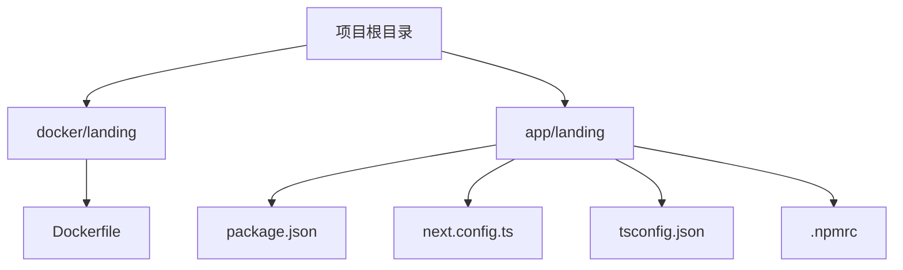
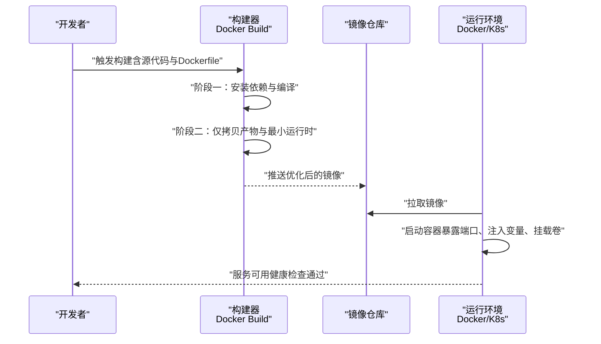
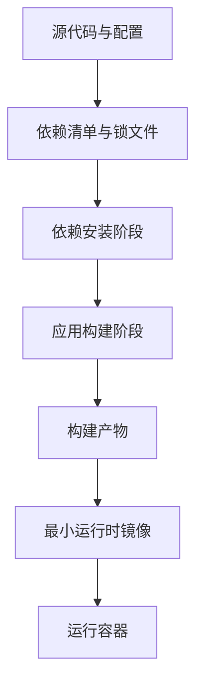

# Docker 容器部署

<cite>
**本文引用的文件**   
- [docker/landing/Dockerfile](file://docker/landing/Dockerfile)
- [README.md](file://README.md)
- [PROJECT.md](file://PROJECT.md)
- [app/landing/package.json](file://app/landing/package.json)
- [app/landing/next.config.ts](file://app/landing/next.config.ts)
- [app/landing/tsconfig.json](file://app/landing/tsconfig.json)
- [app/landing/.npmrc](file://app/landing/.npmrc)
</cite>

## 目录
1. [简介](#简介)
2. [项目结构](#项目结构)
3. [核心组件](#核心组件)
4. [架构总览](#架构总览)
5. [详细组件分析](#详细组件分析)
6. [依赖关系分析](#依赖关系分析)
7. [性能考量](#性能考量)
8. [故障排查指南](#故障排查指南)
9. [结论](#结论)
10. [附录](#附录)

## 简介
本技术文档围绕项目的 Docker 容器化与部署展开，重点覆盖以下方面：
- Dockerfile 构建配置：基础镜像选择、依赖安装、应用打包与镜像优化策略
- 多阶段构建：开发环境与生产环境的差异化配置
- 环境变量、端口映射与数据卷挂载
- 容器编排最佳实践：健康检查、资源限制、日志收集
- 镜像安全扫描、漏洞修复与版本管理流程
- 不同环境下的部署与管理实践

本项目包含一个基于 Next.js 的着陆页应用（位于 app/landing），以及对应的 Docker 构建文件（位于 docker/landing）。

## 项目结构
与容器化相关的核心目录与文件如下：
- docker/landing/Dockerfile：容器构建定义
- app/landing：Next.js 应用源码与构建配置
- README.md、PROJECT.md：项目说明与总体设计

图表来源
- [docker/landing/Dockerfile](file://docker/landing/Dockerfile)
- [app/landing/package.json](file://app/landing/package.json)
- [app/landing/next.config.ts](file://app/landing/next.config.ts)
- [app/landing/tsconfig.json](file://app/landing/tsconfig.json)
- [app/landing/.npmrc](file://app/landing/.npmrc)

章节来源
- [README.md](file://README.md)
- [PROJECT.md](file://PROJECT.md)

## 核心组件
- 容器构建入口：docker/landing/Dockerfile
- Web 应用：app/landing（Next.js）
- 包管理与运行依赖：app/landing/package.json
- 构建与运行时配置：app/landing/next.config.ts、app/landing/tsconfig.json、app/landing/.npmrc

章节来源
- [docker/landing/Dockerfile](file://docker/landing/Dockerfile)
- [app/landing/package.json](file://app/landing/package.json)
- [app/landing/next.config.ts](file://app/landing/next.config.ts)
- [app/landing/tsconfig.json](file://app/landing/tsconfig.json)
- [app/landing/.npmrc](file://app/landing/.npmrc)

## 架构总览
下图展示从代码到容器的典型构建与运行流程。该流程适用于本地开发与 CI/CD 流水线，支持多阶段构建以分离构建期与运行期依赖，从而减小镜像体积并提升安全性。

[此图为概念性流程图，不直接映射具体源文件]

## 详细组件分析

### Dockerfile 构建配置与优化
- 基础镜像选择
  - 建议选用官方 Node.js LTS 镜像作为基础，确保语言运行时稳定与安全更新。
  - 若追求极致体积，可在构建阶段使用带完整工具链的镜像，在运行阶段切换到精简镜像（如 alpine 或 distroless）。
- 依赖安装与缓存
  - 优先复制依赖清单（如 package.json、lock 文件）并执行依赖安装，利用 Docker 层缓存加速重复构建。
  - 将应用源码放在依赖安装之后，避免不必要的重建。
- 应用打包
  - 对于 Next.js 应用，通常先执行依赖安装，再执行构建命令生成静态产物或可运行产物。
  - 构建产物应被复制到最终镜像的最小运行时环境中。
- 镜像优化策略
  - 多阶段构建：构建阶段负责编译与依赖安装；运行阶段仅包含运行所需文件与运行时。
  - 清理构建缓存：删除临时文件、调试符号与未使用的依赖。
  - 合并 RUN 指令：减少镜像层数，降低 I/O 开销。
  - 非 root 用户运行：提高安全性，遵循最小权限原则。
- 健康检查
  - 在镜像中提供健康检查脚本或使用 HTTP 探针，便于编排系统判断服务可用性。

章节来源
- [docker/landing/Dockerfile](file://docker/landing/Dockerfile)

### 多阶段构建：开发环境与生产环境差异
- 开发环境
  - 使用包含完整工具链的 Node 镜像，启用热重载与调试端口。
  - 挂载源码目录到容器内，便于快速迭代。
  - 设置开发环境变量（如调试开关、详细日志级别）。
- 生产环境
  - 使用精简镜像，仅包含运行依赖与构建产物。
  - 禁用调试功能，关闭不必要日志输出。
  - 固定依赖版本，确保可重现构建。
- 差异化配置实现方式
  - 通过构建参数或环境变量切换不同阶段的镜像与行为。
  - 使用独立的 Dockerfile 或同一 Dockerfile 的多阶段目标。

章节来源
- [docker/landing/Dockerfile](file://docker/landing/Dockerfile)

### 环境变量、端口映射与数据卷挂载
- 环境变量
  - 在容器启动时注入必要的环境变量（如数据库连接串、API 密钥、功能开关）。
  - 建议使用只读配置与敏感信息分离管理（例如通过编排平台注入）。
- 端口映射
  - 明确声明应用监听端口（如 Next.js 默认 3000），并在编排层进行端口映射。
- 数据卷挂载
  - 持久化日志、配置文件或用户上传内容至宿主机或云存储。
  - 使用命名卷或绑定挂载，确保跨节点迁移时的数据一致性。

章节来源
- [docker/landing/Dockerfile](file://docker/landing/Dockerfile)

### Next.js 应用构建与运行要点
- 依赖管理
  - 使用 pnpm 或 npm/yarn 锁定依赖版本，保证构建可重现。
  - 通过 .npmrc 配置私有源或代理（如有需要）。
- 构建配置
  - next.config.ts 控制构建行为（如输出格式、路径别名、插件集成）。
  - tsconfig.json 确保 TypeScript 编译一致性与类型检查。
- 运行模式
  - 生产环境推荐使用独立构建产物（standalone 或静态导出），以减少运行时依赖。
  - 合理设置环境变量（如 NODE_ENV=production）以启用优化。

章节来源
- [app/landing/package.json](file://app/landing/package.json)
- [app/landing/next.config.ts](file://app/landing/next.config.ts)
- [app/landing/tsconfig.json](file://app/landing/tsconfig.json)
- [app/landing/.npmrc](file://app/landing/.npmrc)

### 健康检查与编排最佳实践
- 健康检查
  - 提供 /health 或 /ready 端点，返回 200 表示就绪。
  - 在编排平台配置 liveness 与 readiness 探针，自动重启失败实例与流量摘除。
- 资源限制
  - 为容器设置 CPU 与内存限制，防止资源争用与 OOM。
  - 根据负载特征调整请求限流与副本数量。
- 日志收集
  - 输出结构化 JSON 日志到 stdout/stderr，便于集中采集。
  - 使用日志轮转与保留策略，控制磁盘占用。

章节来源
- [docker/landing/Dockerfile](file://docker/landing/Dockerfile)

### 镜像安全扫描、漏洞修复与版本管理
- 安全扫描
  - 在 CI 中集成镜像扫描工具（如 Trivy、Clair），对基础镜像与应用依赖进行漏洞检测。
  - 阻断高危漏洞镜像进入生产环境。
- 漏洞修复
  - 定期更新基础镜像与依赖版本，采用语义化版本锁定。
  - 建立补丁分支与回滚策略，确保快速修复。
- 版本管理
  - 使用 Git 标签与镜像标签对应，记录构建元数据（提交哈希、构建时间）。
  - 保留历史镜像以便回滚与审计。

章节来源
- [docker/landing/Dockerfile](file://docker/landing/Dockerfile)
- [app/landing/package.json](file://app/landing/package.json)

### 不同环境部署与管理
- 本地开发
  - 使用 docker-compose 或 kubectl 本地集群，快速验证构建与服务。
  - 挂载源码与热重载，缩短反馈周期。
- 测试环境
  - 自动化构建与部署，执行集成测试与性能基准。
  - 注入测试数据与模拟外部依赖。
- 生产环境
  - 灰度发布与蓝绿部署，降低变更风险。
  - 监控告警与容量规划，保障高可用与弹性伸缩。

章节来源
- [docker/landing/Dockerfile](file://docker/landing/Dockerfile)

## 依赖关系分析
下图展示了 Docker 构建过程中各组件之间的依赖关系与数据流向。

图表来源
- [docker/landing/Dockerfile](file://docker/landing/Dockerfile)
- [app/landing/package.json](file://app/landing/package.json)
- [app/landing/next.config.ts](file://app/landing/next.config.ts)

章节来源
- [docker/landing/Dockerfile](file://docker/landing/Dockerfile)
- [app/landing/package.json](file://app/landing/package.json)

## 性能考量
- 构建性能
  - 充分利用 Docker 层缓存，按顺序复制依赖清单与源码。
  - 并行安装依赖与构建任务，缩短构建时间。
- 镜像体积
  - 多阶段构建与精简基础镜像，移除调试信息与无用文件。
  - 合并 RUN 指令，减少层数。
- 运行时性能
  - 启用应用级缓存与压缩（如 CDN、HTTP 缓存头）。
  - 合理设置线程池与连接池大小，避免资源耗尽。

[本节为通用指导，不直接分析具体文件]

## 故障排查指南
- 构建失败
  - 检查依赖安装是否成功，确认网络与镜像源可达。
  - 查看构建日志定位错误行，必要时增加调试输出。
- 运行异常
  - 验证环境变量是否正确注入，端口是否冲突。
  - 检查健康检查端点与探针配置，确认服务就绪状态。
- 性能问题
  - 分析 CPU 与内存使用曲线，识别瓶颈模块。
  - 调整资源限制与副本数量，观察效果变化。

章节来源
- [docker/landing/Dockerfile](file://docker/landing/Dockerfile)

## 结论
通过多阶段构建、镜像优化与健康检查等实践，可以显著提升容器化应用的构建效率、运行稳定性与安全性。结合完善的依赖管理、安全扫描与版本控制流程，能够在不同环境下可靠地部署与管理容器实例。

[本节为总结性内容，不直接分析具体文件]

## 附录
- 参考文件
  - [README.md](file://README.md)
  - [PROJECT.md](file://PROJECT.md)
  - [docker/landing/Dockerfile](file://docker/landing/Dockerfile)
  - [app/landing/package.json](file://app/landing/package.json)
  - [app/landing/next.config.ts](file://app/landing/next.config.ts)
  - [app/landing/tsconfig.json](file://app/landing/tsconfig.json)
  - [app/landing/.npmrc](file://app/landing/.npmrc)

[本节为参考列表，不直接分析具体文件]