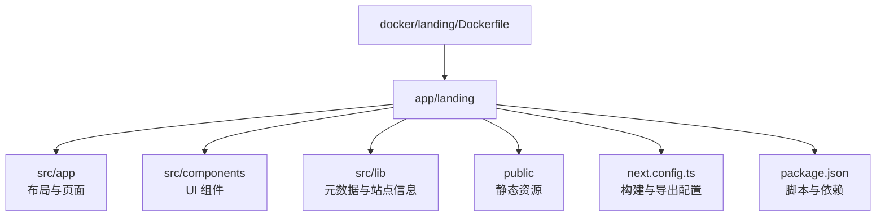
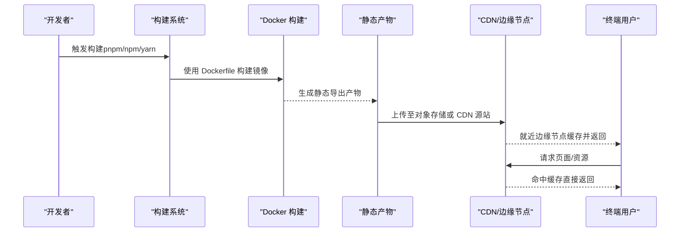
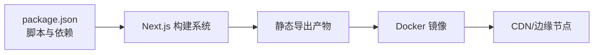

# 静态站点部署

<cite>
**本文引用的文件**   
- [next.config.ts](file://app/landing/next.config.ts)
- [package.json](file://app/landing/package.json)
- [layout.tsx](file://app/landing/src/app/layout.tsx)
- [page.tsx](file://app/landing/src/app/page.tsx)
- [robots.ts](file://app/landing/src/app/robots.ts)
- [sitemap.ts](file://app/landing/src/app/sitemap.ts)
- [metadata.ts](file://app/landing/src/lib/metadata.ts)
- [site.ts](file://app/landing/src/lib/site.ts)
- [JsonLd.tsx](file://app/landing/src/components/JsonLd.tsx)
- [Dockerfile](file://docker/landing/Dockerfile)
</cite>

## 目录
1. [简介](#简介)
2. [项目结构](#项目结构)
3. [核心组件](#核心组件)
4. [架构总览](#架构总览)
5. [详细组件分析](#详细组件分析)
6. [依赖分析](#依赖分析)
7. [性能考虑](#性能考虑)
8. [故障排查指南](#故障排查指南)
9. [结论](#结论)
10. [附录](#附录)

## 简介
本技术文档面向“静态站点部署”，围绕 Next.js 应用的构建与发布策略展开，重点覆盖：
- 静态导出（Static Export）配置与最佳实践
- 增量静态再生（ISR）在静态站点中的适用性与替代方案
- API 路由处理与边缘化策略
- CDN 部署策略：缓存头、边缘计算与全球加速
- 域名绑定、SSL 证书管理与 HTTPS 强制重定向
- 环境变量安全管理：密钥轮换与访问控制
- 监控与日志集成：性能指标收集与错误追踪
- SEO 优化、社交媒体分享与搜索引擎收录

本仓库包含一个基于 Next.js 的着陆页应用（位于 app/landing），以及用于容器化构建的 Dockerfile。下文将结合这些文件给出可操作的部署指南与架构建议。

## 项目结构
Next.js 着陆页应用位于 app/landing，采用 App Router 组织页面与布局，资源与组件分离清晰；同时提供 docker/landing/Dockerfile 以支持容器化构建与分发。

图表来源
- [next.config.ts](file://app/landing/next.config.ts)
- [package.json](file://app/landing/package.json)
- [layout.tsx](file://app/landing/src/app/layout.tsx)
- [page.tsx](file://app/landing/src/app/page.tsx)
- [Dockerfile](file://docker/landing/Dockerfile)

章节来源
- [next.config.ts](file://app/landing/next.config.ts)
- [package.json](file://app/landing/package.json)
- [layout.tsx](file://app/landing/src/app/layout.tsx)
- [page.tsx](file://app/landing/src/app/page.tsx)
- [Dockerfile](file://docker/landing/Dockerfile)

## 核心组件
- 构建与导出配置：通过 next.config.ts 定义静态导出、输出目录、图片优化、路径重写等关键行为。
- 应用布局与页面：App Router 的 layout.tsx 与 page.tsx 负责全局元数据注入、主题与基础 UI 骨架。
- SEO 与站点地图：robots.ts 与 sitemap.ts 生成爬虫规则与站点索引；metadata.ts 集中管理站点元信息。
- JSON-LD 结构化数据：JsonLd.tsx 组件用于注入结构化数据以提升搜索引擎理解能力。
- 容器化构建：docker/landing/Dockerfile 定义多阶段构建流程，确保产物最小化并便于 CDN 分发。

章节来源
- [next.config.ts](file://app/landing/next.config.ts)
- [layout.tsx](file://app/landing/src/app/layout.tsx)
- [page.tsx](file://app/landing/src/app/page.tsx)
- [robots.ts](file://app/landing/src/app/robots.ts)
- [sitemap.ts](file://app/landing/src/app/sitemap.ts)
- [metadata.ts](file://app/landing/src/lib/metadata.ts)
- [JsonLd.tsx](file://app/landing/src/components/JsonLd.tsx)
- [Dockerfile](file://docker/landing/Dockerfile)

## 架构总览
下图展示从源码到 CDN 分发的整体流程，包括构建、导出、容器镜像与边缘缓存。

图表来源
- [Dockerfile](file://docker/landing/Dockerfile)
- [next.config.ts](file://app/landing/next.config.ts)
- [package.json](file://app/landing/package.json)

## 详细组件分析

### 构建与静态导出（next.config.ts）
- 静态导出：启用静态导出模式，确保所有页面预渲染为 HTML/CSS/JS，适合 CDN 直发。
- 输出目录：指定构建产物目录，便于 CI/CD 打包与上传。
- 图片优化：按需开启图片优化与格式转换，减少体积并提升加载速度。
- 路径与重写：根据部署环境配置路径前缀与重定向规则，适配 CDN 子路径或反向代理。
- 环境变量：读取构建时环境变量，区分开发、测试与生产行为。

章节来源
- [next.config.ts](file://app/landing/next.config.ts)

### 应用布局与页面（layout.tsx / page.tsx）
- 全局布局：定义字符集、主题、字体与全局样式，确保一致的用户体验。
- 元数据注入：集中设置标题、描述、图标、Open Graph 与 Twitter Card，利于 SEO 与社交分享。
- 页面内容：首页结构与组件组合，保证首屏内容与交互快速呈现。

章节来源
- [layout.tsx](file://app/landing/src/app/layout.tsx)
- [page.tsx](file://app/landing/src/app/page.tsx)

### SEO 与站点地图（robots.ts / sitemap.ts / metadata.ts）
- robots.ts：定义爬虫抓取策略，避免敏感路径被索引。
- sitemap.ts：动态生成站点地图，提高搜索引擎收录效率。
- metadata.ts：统一站点元数据，便于跨页面复用与一致性维护。

章节来源
- [robots.ts](file://app/landing/src/app/robots.ts)
- [sitemap.ts](file://app/landing/src/app/sitemap.ts)
- [metadata.ts](file://app/landing/src/lib/metadata.ts)

### JSON-LD 结构化数据（JsonLd.tsx）
- 注入结构化数据：为产品、组织、FAQ 等类型提供语义化标记，增强搜索引擎理解。
- 组件化封装：便于在不同页面复用，保持数据结构一致。

章节来源
- [JsonLd.tsx](file://app/landing/src/components/JsonLd.tsx)

### 容器化构建（Dockerfile）
- 多阶段构建：先安装依赖并构建，再复制产物到轻量运行时镜像，减小最终镜像体积。
- 构建缓存：利用层缓存加速重复构建。
- 安全加固：以非 root 用户运行，限制权限。

章节来源
- [Dockerfile](file://docker/landing/Dockerfile)

### API 路由处理与边缘化策略
- 静态站点中通常不包含服务端 API；如需接口能力，建议使用外部服务（如 Serverless Functions、Edge Functions 或第三方 API）。
- 若必须内嵌 API，可在 Next.js 中使用 API Routes，但需评估对静态导出的影响，必要时切换为混合渲染或纯服务端渲染。
- 边缘化建议：将热点逻辑迁移至边缘函数（如 Cloudflare Workers、Vercel Edge、AWS Lambda@Edge），以降低延迟并提升可用性。

章节来源
- [next.config.ts](file://app/landing/next.config.ts)
- [package.json](file://app/landing/package.json)

## 依赖分析
- 构建工具链：基于 pnpm/npm/yarn 与 Node.js，配合 Next.js 生态进行开发与构建。
- 容器化：Docker 用于标准化构建环境与产物分发。
- CDN 与边缘：通过对象存储 + CDN 实现全球加速与缓存命中。

图表来源
- [package.json](file://app/landing/package.json)
- [Dockerfile](file://docker/landing/Dockerfile)

章节来源
- [package.json](file://app/landing/package.json)
- [Dockerfile](file://docker/landing/Dockerfile)

## 性能考虑
- 静态导出优先：尽可能使用静态导出以获得最佳缓存命中率与加载速度。
- 资源压缩与合并：启用构建时的 JS/CSS 压缩与按需加载，减少首屏体积。
- 图片优化：使用现代格式（WebP/AVIF）、懒加载与响应式尺寸。
- CDN 缓存策略：合理设置 Cache-Control、ETag、Last-Modified，区分静态资源与动态内容。
- 边缘计算：将热点逻辑下沉到边缘节点，降低回源率与延迟。
- 构建缓存：CI/CD 中充分利用依赖与构建层缓存，缩短构建时间。

## 故障排查指南
- 构建失败：检查 Node.js 版本、依赖安装与权限问题；查看构建日志定位具体错误。
- 静态导出异常：确认页面是否使用了客户端专属 API；必要时降级为 SSR 或移除不兼容代码。
- CDN 缓存未生效：验证缓存头是否正确设置；清理 CDN 缓存后重试。
- SSL 证书问题：检查证书链完整性与域名解析；确保 HTTPS 强制重定向已启用。
- 环境变量缺失：核对构建时与环境运行时的变量注入；避免在生产环境泄露敏感信息。

## 结论
通过静态导出与 CDN 部署，Next.js 着陆页可获得极佳的加载性能与高可用。结合合理的缓存策略、边缘计算与 SEO 优化，能够显著提升用户体验与搜索引擎表现。建议在持续集成中固化构建与发布流程，并建立完善的监控与告警体系，保障线上稳定性。

## 附录

### CDN 部署策略与缓存头配置
- 缓存头建议：
  - 静态资源（js/css/img）：Cache-Control 长缓存 + 版本号或哈希
  - HTML 页面：短缓存或无缓存，配合 ETag/Last-Modified 校验
  - 字体与媒体：按内容更新频率设置合适的过期时间
- 边缘计算：
  - 使用边缘函数处理鉴权、A/B 测试、地理路由与个性化内容
  - 将热点 API 调用下沉到边缘，减少回源压力
- 全球加速：
  - 选择具备全球节点的 CDN，启用 HTTP/2 与 QUIC
  - 开启智能路由与就近调度，提升访问速度

### 域名绑定、SSL 证书与 HTTPS 强制重定向
- 域名绑定：在 CDN 控制台绑定自定义域名，完成 DNS 解析与 CNAME 配置
- SSL 证书：
  - 使用托管证书（自动续期）或上传自有证书
  - 确保证书链完整，避免中间证书缺失
- HTTPS 强制重定向：
  - 在 CDN 或反向代理层启用 301 重定向
  - 确保 HSTS 与安全头部正确设置

### 环境变量安全管理
- 密钥轮换：
  - 定期轮换 API Key、签名密钥与数据库密码
  - 使用密钥管理服务（如 Vault、KMS）集中管理
- 访问控制：
  - 最小权限原则，限制环境变量访问范围
  - 在 CI/CD 中加密存储敏感变量，避免明文提交
- 构建时注入：
  - 区分构建时与运行时需要的环境变量
  - 避免将敏感信息打入静态产物

### 监控与日志集成
- 性能指标：
  - 采集 Core Web Vitals（LCP、FID、CLS）与自定义指标
  - 使用 RUM（真实用户监控）与 APM 工具跟踪前端性能
- 错误追踪：
  - 集成错误上报（如 Sentry、Bugsnag）捕获前端异常
  - 记录关键用户行为与转化漏斗
- 日志聚合：
  - 集中收集访问日志与应用日志
  - 设置告警阈值与自动化响应

### SEO 优化、社交媒体分享与搜索引擎收录
- SEO 最佳实践：
  - 完善 meta 标签、标题与描述
  - 使用语义化 HTML 与结构化数据（JSON-LD）
  - 生成 sitemap.xml 并提交至搜索引擎
- 社交媒体分享：
  - 配置 Open Graph 与 Twitter Card 元数据
  - 提供清晰的缩略图与描述文本
- 搜索引擎收录：
  - 提交 sitemap 与 robots.txt
  - 使用 Search Console 监控抓取与索引状态