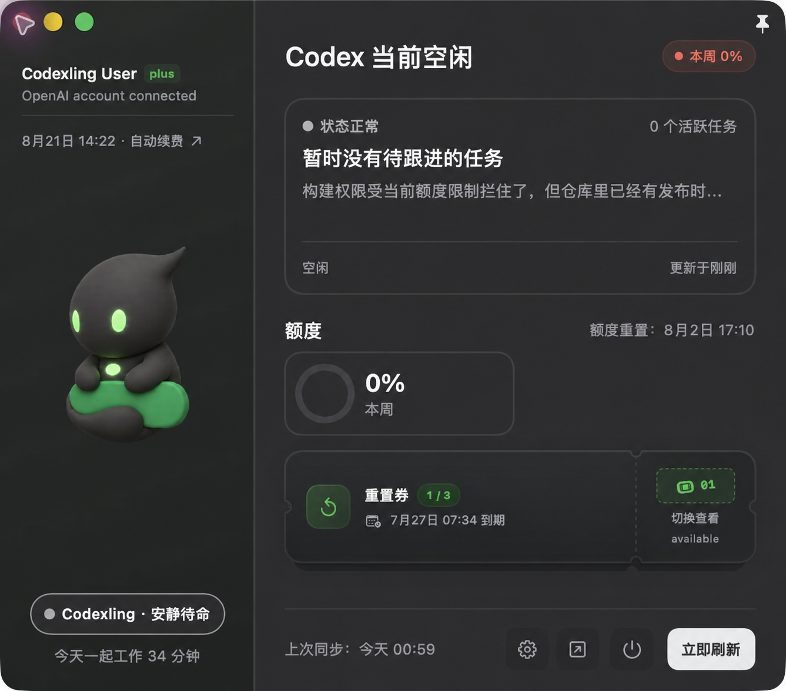
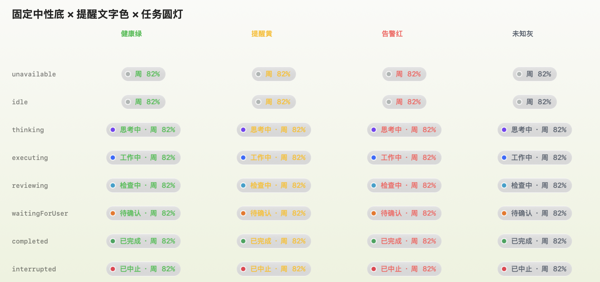
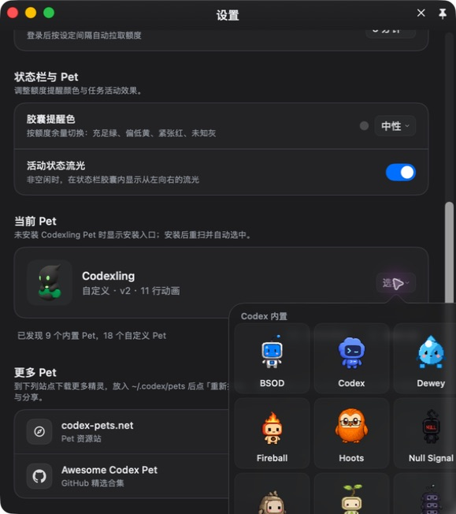
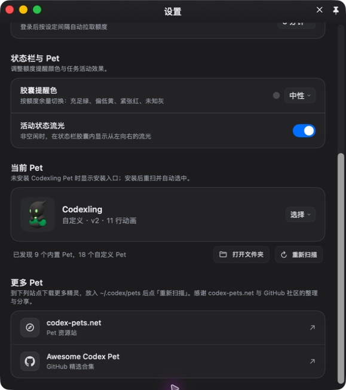

# Codexling

Codexling 是一款原生 macOS 菜单栏 App。它把 Codex 的任务状态、Pet 和额度放在
随时看得见的地方；需要更多信息时，再用悬停卡片或独立窗口查看并行任务、今日陪伴时间、
重置券，以及可获取的 ChatGPT 订阅周期。

[下载最新版本](https://github.com/xseven77/Codexling/releases) ·
[访问 Landing](https://codexling.qiizo.cn) ·
[查看当前方案](docs/codexling方案.md)



> 截图来自 Codexling 0.3.8 发布包。主窗口仅对账号姓名和邮箱做了匿名化处理；
> 设置与 Pet 选择截图通过调整真实窗口构图避开账号区域，没有重绘界面内容。

## 主要能力

- 菜单栏圆灯显示空闲、思考、工作、检查、等待确认、完成或中止等任务状态。
- 菜单栏文字显示当前有效额度窗口；胶囊使用固定透明中性色，提醒色只作用于文字。
- 悬停菜单栏胶囊约 120ms 后显示不抢焦点的 Pet 与任务摘要卡片。
- 独立窗口显示并行任务、工作区、分支、模型、截断状态摘要与今日陪伴时间。
- 显示主/次级额度、重置时间、重置券，以及可读取的订阅周期。
- 发现 Codex 内置 Pet 和 `~/.codex/pets` 自定义 Pet，并与 Codex 当前选择同步。
- 支持主题、自动刷新、活动流光、窗口置顶和 App 内更新。

## 系统要求

- macOS 14 或更高版本。
- 查看本地任务和内置 Pet 时，需要安装 Codex/ChatGPT macOS App。
- 查看额度、重置券和订阅周期时，需要通过 OAuth 登录相应的 OpenAI 账号。

## 安装与首次启动

1. 前往 [GitHub Releases](https://github.com/xseven77/Codexling/releases)。
2. 推荐下载 DMG，打开后把 `Codexling.app` 拖入 `Applications`；也可以下载 ZIP
   并手动解压到 `Applications`。
3. 启动 Codexling。它是菜单栏 App，正常情况下不会在 Dock 中保留常驻图标。
4. 如果 macOS 阻止首次打开，请进入“系统设置 → 隐私与安全性”，确认允许打开 Codexling。

当前发布包使用 ad-hoc 签名，尚未完成 Apple notarization。

首次启动会自动打开主窗口。关闭窗口后 App 仍会留在菜单栏中；这不是异常，也不等于退出。

## 快速开始

1. 点击 macOS 菜单栏中的 Codexling 胶囊，打开主窗口。
2. 点击“登录并同步额度”。
3. 在 `auth.openai.com` 页面完成 OAuth PKCE 授权。
4. 浏览器完成授权后会返回本机
   `http://localhost:1455/auth/callback`，Codexling 随即同步额度。
5. 打开 Codex 开始任务；Codexling 会从本机 Codex 数据中只读归并任务状态。

登录完成后可以点击“立即刷新”手动同步，也可以在设置中选择自动刷新间隔。
授权页最多等待 90 秒；如果回调超时或本机 1455 端口被占用，请关闭占用端口的程序后重试。

## 使用手册

### 菜单栏

菜单栏胶囊由三个独立部分组成：

| 部分 | 含义 |
|---|---|
| 前置圆灯 | 当前优先级最高的 Codex 任务状态 |
| 文字 | 任务状态和当前有效额度，例如 `工作中 · 5h 42% · 周 77%` |
| 胶囊提醒色 | 可固定颜色或跟随额度，只改变文字颜色，不改变中性透明背景 |

圆灯颜色和任务状态一一对应：

| 颜色 | 状态 |
|---|---|
| 灰色 | 空闲，或本地任务数据暂不可用 |
| 紫色 | 正在思考 |
| 蓝色 | 正在执行 |
| 青色 | 正在检查 |
| 橙色 | 等待确认 |
| 绿色 | 已完成 |
| 红色 | 已中止 |

圆灯只表达任务状态，和提醒色相互独立。提醒色沿用主窗口
`QuotaAtAGlanceChip` 的绿、黄、红、灰语义，但只用于纯色文字。
胶囊在所有状态和主题下使用同一套固定透明中性色，不读取菜单栏壁纸亮度，也不会随
额度或任务状态改变背景色。



常用交互：

- **单击胶囊**：打开或唤起主窗口。
- **Material wave**：按下时，中性墨水从实际点击位置扩散一次。
- **悬停约 120ms**：显示当前 Pet、任务标题、状态摘要和活跃任务数，不抢键盘焦点。
- **活动状态 Wave**：开启后，非空闲状态会从任务圆灯向四周持续扩散。

### 主窗口

主窗口左侧显示账号、可获取的订阅周期、当前 Pet 和今日陪伴时间；右侧显示任务、额度与重置券。

- 任务卡展示状态、thread 名称、工作区、Git 分支、模型和截断后的状态摘要。
- 多个任务同时运行时，窗口会展示任务数量，并按等待确认、执行、检查、思考等优先级汇总。
- 点击任务卡可以依次查看每个任务；等待确认的任务会优先显示，Codex 的 subagent
  不会作为独立任务计入列表。
- 点击 Pet 可以播放一次随机互动动作；任务运行时仍可互动。
- 有多张未过期重置券时，点击券面右侧的票根可依次查看；已过期的券不会显示。
- 右上角图钉只控制当前 macOS Space 中的窗口置顶。
- 底部按钮依次用于设置、打开官方 Usage、退出 App 和立即刷新。

“今天一起工作”会累计思考、执行、检查和等待确认的时间。统计每 30 秒写入本机，
单次结算最多计 90 秒，避免 Mac 休眠后把整段离线时间算进去。

### 切换 Pet

1. 点击主窗口底部的齿轮，进入“设置”。
2. 找到“当前 Pet”，点击右侧“选择”。
3. 从“Codex 内置”或“自定义”分组中选择一个 Pet。
4. Codexling 窗口会切换到新 Pet，并把选择写入 Codex 配置。
5. 当前正在运行的 Codex 通常不会热刷新 Pet。出现“Codex 重启后生效”提示时，
   点击“重启 Codex”即可；重启可能中断正在运行或等待确认的任务，请先确认任务状态。

<p align="center">
  
</p>

Codexling 会监控 Codex 的 Pet 配置变化。如果之后在 Codex 中切换 Pet，Codexling
也会同步新的选择。

### 安装 Codexling Pet

如果专属 Codexling Pet 尚未安装，设置页会显示“安装 Codexling Pet”卡片：

1. 点击“安装”。
2. App 将 Pet 安装到 `~/.codex/pets/codexling`。
3. 安装完成后会重新扫描并自动选择 Codexling Pet。
4. 按提示重启 Codex，使 Codex 内的 Pet 同步生效。

### 添加自定义 Pet

自定义 Pet 使用 Codex 的标准目录：

```text
~/.codex/pets/<pet-id>/
├── pet.json
└── spritesheet.webp
```

操作步骤：

1. 在设置页“当前 Pet”区域点击“打开文件夹”。
2. 把完整的 Pet 目录复制到 `~/.codex/pets`。
3. 返回 Codexling，点击“重新扫描”。
4. 点击“选择”，从“自定义”分组中选择新 Pet。
5. 如果 App 提示重启 Codex，确认没有重要任务运行后再执行。

设置页还提供 [codex-pets.net](https://codex-pets.net/) 和
[Awesome Codex Pet](https://github.com/legeling/awesome-codex-pet) 入口。
损坏、缺少 manifest 或图集规格不兼容的 Pet 不会进入选择列表。

最小 `pet.json` 示例：

```json
{
  "id": "my-pet",
  "displayName": "My Pet",
  "description": "可选说明",
  "spriteVersionNumber": 2,
  "spritesheetPath": "spritesheet.webp"
}
```

图集每帧为 `192 × 208` 像素，每行 8 帧，所以宽度必须为 `1536` 像素；高度必须是
`208` 的整数倍并至少有 9 行。v2 Pet 通常使用 11 行，即 `1536 × 2288` 像素。

### 设置

<p align="center">
  
</p>

| 设置 | 可选项与行为 |
|---|---|
| 主题 | 跟随系统、浅色、深色 |
| 自动刷新 | 30 秒、1 分钟（默认）、2 分钟、5 分钟、10 分钟、关闭 |
| 胶囊提醒色 | 中性（默认）、跟随额度、绿色、黄色、红色、灰色 |
| 活动状态 Wave | 控制非空闲时从任务圆灯向外扩散的状态效果 |
| 当前 Pet | 预览、选择、安装、打开自定义目录和重新扫描 |
| 应用更新 | 检查 GitHub Releases，发现新版本后下载并安装 DMG |

窗口置顶不在设置列表中：请使用主窗口右上角的图钉按钮。

### 检查和安装更新

1. 打开“设置 → 应用”。
2. 点击“检查更新”。
3. 如果发现更高版本，按钮会变为“下载并安装”。
4. Codexling 下载 GitHub Release 中的 DMG，安装完成后自动重新启动。

也可以点击旁边的外链按钮直接打开 GitHub Releases，手动下载 DMG 或 ZIP。
Codexling 不会在启动时自动检查版本，需要你在设置中手动触发。

### 退出登录与退出 App

- **退出登录**：位于设置页账号区域。确认后会删除本地 OAuth token；再次查看额度需要重新授权。
  最近一次额度快照和陪伴统计不会随 token 一起删除。
- **退出 App**：主窗口底部的电源按钮。确认后 Codexling 完全退出，菜单栏图标也会消失。
- 关闭普通窗口只会隐藏窗口，不等于退出 App。

## 本地数据与隐私边界

- OAuth 在 `auth.openai.com` 完成，Codexling 不接收或保存账号密码。
- OAuth token 保存在
  `~/Library/Application Support/Codexling/oauth_token.json`，文件权限为 `0600`。
- 旧版本 Keychain token 仅用于一次性迁移，迁移完成后会删除旧记录。
- Codexling 会只读查看本机 Codex thread 索引和 rollout 文件末尾；当前解析器只使用任务
  生命周期事件、工具元数据，以及用户可见 commentary 中可用于展示状态的文字。
- 界面可能展示 thread 名称、工作区、分支、模型和最多 100 个字符的最近状态摘要；
  这些任务数据不会由 Codexling 另行上传。
- 最后一次成功的额度快照和陪伴统计缓存在本机，用于启动和暂时离线时展示。
- 重置券与订阅周期是可选请求；获取失败不会覆盖已经成功的主额度结果。

常用本地路径：

| 数据 | 路径 |
|---|---|
| OAuth token | `~/Library/Application Support/Codexling/oauth_token.json` |
| 最近额度快照 | `~/Library/Application Support/Codexling/latest_snapshot.json` |
| 今日陪伴统计 | `~/Library/Application Support/Codexling/companion_stats.json` |
| Codex 内置 Pet 缓存 | `~/Library/Application Support/Codexling/Pets/<Codex 版本>/` |
| 自定义 Pet | `~/.codex/pets/` |
| Codex 任务索引 | `~/.codex/state_5.sqlite` 或 `~/.codex/sqlite/state_5.sqlite` |

## 常见问题

### 菜单栏没有出现 Codexling

重新打开 `Applications/Codexling.app`。Codexling 是菜单栏 App，不要只在 Dock 中寻找。

### 首次打开被 macOS 阻止

进入“系统设置 → 隐私与安全性”，在相关提示旁选择允许打开。当前构建尚未 notarize。

### 显示“未登录”或额度没有更新

打开主窗口并点击“登录并同步额度”或“立即刷新”。如果授权已失效，重新完成 OAuth。
如果浏览器停在回调页，请确认授权未超过 90 秒，并检查是否有其他程序占用了本机 1455 端口。

### 没有发现任务

确认 Codex macOS App 已安装并至少创建过一个本地 thread。Codexling 只读本机 thread
索引；本地格式不可用时任务状态会回退为不可用，但额度功能仍可使用。

### 找不到内置 Pet

确认 Codex/ChatGPT App 位于 `/Applications` 或 `~/Applications`。更新 Codex 后，
在 Codexling 设置页点击“重新扫描”。

### 自定义 Pet 没有出现在列表中

确认目录位于 `~/.codex/pets/<pet-id>`，并同时包含有效的 `pet.json` 与
`spritesheet.webp`，然后点击“重新扫描”。

### 已切换 Pet，但 Codex 中仍显示旧 Pet

查看设置页是否出现“Codex 重启后生效”。当前运行中的 Codex 不会自动刷新 Pet；
在没有重要任务运行时点击“重启 Codex”。

### App 内更新失败

使用设置页旁边的 GitHub Releases 外链，手动下载最新 DMG。替换
`Applications/Codexling.app` 后重新启动。

## 从源码构建

```bash
cd app/Codexling
./package_app.sh
open "dist/Codexling.app"
```

交互式打包与发布：

```bash
cd app/Codexling
./release_app.sh
```

详见[发布脚本说明](app/Codexling/RELEASE.zh-CN.md)。如果 `swift build` 提示 Apple SDK
许可未接受，请先在 Terminal 运行：

```bash
sudo xcodebuild -license
```

## Landing 开发

```bash
cd app/landing
pnpm install
pnpm dev
```

## 项目结构

```text
app/
├── Codexling/       # Swift / SwiftUI 原生 App、测试和发布脚本
└── landing/         # Next.js landing
assets/screenshots/  # README 使用的原生 App 截图
docs/                # 当前方案、实现记录和文档漂移审计
docker/landing/      # landing 容器部署配置
PROJECT.md           # 当前项目状态与技术边界
README.md
```

## 进一步阅读

- [当前项目状态与技术边界](PROJECT.md)
- [总体方案](docs/codexling方案.md)
- [状态栏与 Pets](docs/status-bar-pets.md)
- [主界面布局方向（横向 / 竖向）](docs/dashboard-orientation.md)
- [陪伴式 UI 实现记录](docs/ui-refresh-implementation-plan.md)
- [流体玻璃主题与窗口边界](docs/liquid-glass-theme.md)
- [Pet 与 companion 状态同步](docs/pet-companion-state-plan.md)
- [ChatGPT Plus/Pro 订阅周期](docs/chatgpt-plus-pro-membership-expiry.md)
- [文档漂移审计与演进证据](docs/documentation-drift-audit.md)

当前仓库公开源码供审阅；文档中的现行行为以当前源码和测试为准。
