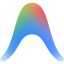
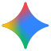
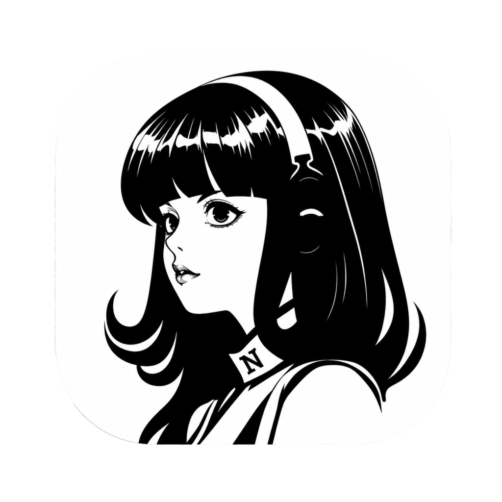
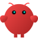
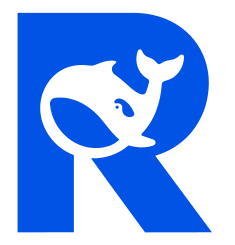
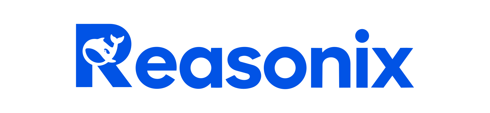
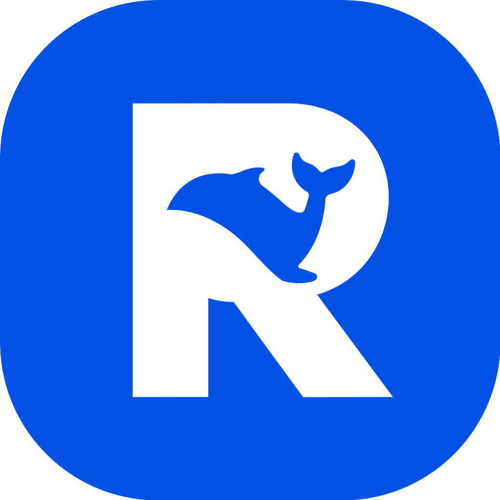
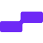

# Brand 资源清单（BRAND INVENTORY）

> 与 `assets/brands/catalog/` 实际文件保持一致。命名模板（最小最优）：`icon.svg` 方形图标 · `logo.svg`/`logo.png` 横向完整 logo · `color.svg` 彩色图标（上游提供时）· `app-icon.png` 官方 app 图标（官方仓库提供时）。

共 **44** 个品牌：19 Agent + 25 Provider。

| # | Brand | 类型 | icon | logo | color | app-icon |
|---|-------|------|:----:|:----:|:------:|:--------:|
| 1 | `anthropic` Anthropic | Provider |  |  | — | — |
| 2 | `antigravity` Antigravity | Agent |  |  |  | — |
| 3 | `aws-bedrock` AWS Bedrock | Provider |  |  |  | — |
| 4 | `azure-ai` Azure AI | Provider |  |  |  | — |
| 5 | `claude-code` Claude Code | Agent |  |  |  | — |
| 6 | `cloudflare-workers-ai` Cloudflare Workers AI | Provider |  |  |  | — |
| 7 | `codex` Codex | Agent |  |  |  | — |
| 8 | `cohere` Cohere | Provider |  |  |  | — |
| 9 | `cursor` Cursor | Agent |  |  | — | — |
| 10 | `deepseek` DeepSeek | Provider |  |  |  | — |
| 11 | `devin` Devin | Agent |  |  |  | — |
| 12 | `fireworks` Fireworks | Provider |  |  |  | — |
| 13 | `gemini-cli` Gemini CLI | Agent |  |  |  | — |
| 14 | `github-copilot` GitHub Copilot | Agent |  |  |  | — |
| 15 | `google-gemini` Google Gemini | Provider |  |  |  | — |
| 16 | `groq` Groq | Provider |  |  | — | — |
| 17 | `hermes-agent` Hermes Agent | Agent |  |  | — |  |
| 18 | `hugging-face` Hugging Face | Provider |  |  |  | — |
| 19 | `kimi-code` Kimi Code | Agent |  |  |  | — |
| 20 | `kiro` Kiro | Agent |  |  |  | — |
| 21 | `lm-studio` LM Studio | Provider |  |  | — | — |
| 22 | `minimax` MiniMax | Provider |  |  |  | — |
| 23 | `mistral` Mistral | Provider |  |  |  | — |
| 24 | `moonshot` Moonshot | Provider |  |  | — | — |
| 25 | `nvidia` NVIDIA | Provider |  |  |  | — |
| 26 | `ollama` Ollama | Provider |  |  | — | — |
| 27 | `openai` OpenAI | Provider |  |  | — | — |
| 28 | `openclaw` OpenClaw | Agent |  |  |  | — |
| 29 | `opencode` OpenCode | Agent |  |  | — | — |
| 30 | `openhands` OpenHands | Agent |  |  |  | — |
| 31 | `openrouter` OpenRouter | Provider |  |  |  | — |
| 32 | `perplexity` Perplexity | Provider |  |  |  | — |
| 33 | `pi-agent` Pi Agent | Agent |  |  | — | — |
| 34 | `qoder` Qoder | Agent |  |  |  | — |
| 35 | `qwen` Qwen | Provider |  |  |  | — |
| 36 | `qwen-code` Qwen Code | Agent |  |  |  | — |
| 37 | `reasonix` Reasonix | Agent |  |  | — |  |
| 38 | `replit` Replit | Agent |  |  |  | — |
| 39 | `siliconflow` SiliconFlow | Provider |  |  |  | — |
| 40 | `together` Together AI | Provider |  |  |  | — |
| 41 | `vertex-ai` Vertex AI | Provider |  |  |  | — |
| 42 | `windsurf` Windsurf | Agent |  |  | — | — |
| 43 | `xai` xAI | Provider |  |  | — | — |
| 44 | `zhipu` Zhipu | Provider |  |  |  | — |

## 命名规则

- **icon.svg**：方形品牌图标，用于紧凑控件（状态栏、连接切换器）。
- **logo.svg / logo.png**：横向完整 logo 或 wordmark，用于大卡片。优先 SVG，无 SVG 时用 PNG。
- **color.svg**：彩色图标，仅当上游（Lobe Icons 等）提供彩色版时才存在；OpenAI/Anthropic 等单色品牌天然无彩色版。
- **app-icon.png**：官方应用图标，仅当官方仓库提供时才有（目前仅 reasonix 提供）。

## 缺失说明

- 缺 `color.svg`（13 个）：`anthropic, cursor, groq, hermes-agent, lm-studio, moonshot, ollama, openai, opencode, pi-agent, reasonix, windsurf, xai`。多为单色品牌，上游无彩色版。
- 缺 `app-icon.png`（43 个）：官方仓库未提供可复用的 app 图标。

## 同步机制

- 唯一真源：`assets/brands/catalog/`（本仓库根目录，Codexling 打包与 landing 共用）。
- Codexling：`package_app.sh` 将 `assets/brands` 整体复制进 app 包 `Resources/BrandAssets`。
- landing：`app/landing/scripts/sync-brand-assets.mjs` 在 predev/prebuild 把 `assets/brands/catalog` 同步到 `public/brand-assets`（该目录已被 .gitignore，不入库）。
