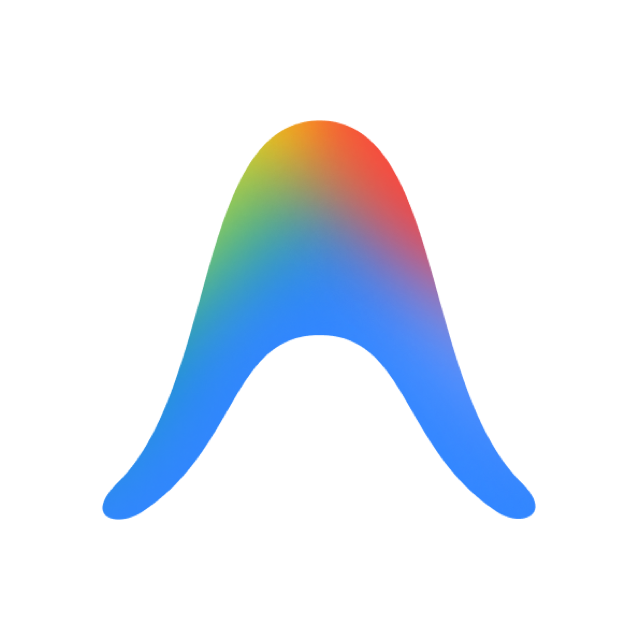
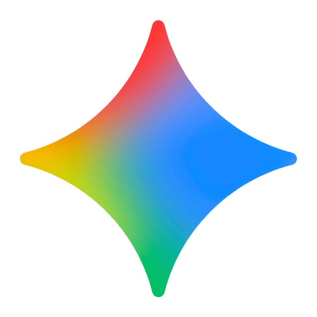

# Brand 资源清单（BRAND INVENTORY）

> 与 `assets/brands/catalog/` 实际文件保持一致。
> 命名模板：`icon.svg` 方形图标 · `logo.svg`/`logo.png` 横向完整 logo · `color.svg` 彩色矢量图标 · `app-icon.png` 官方/Lobe Icons 原版高清光栅图标。

共 **44** 个品牌：19 Agent + 25 Provider。

| # | Brand | 类型 | 来源 | icon | logo | color | app-icon |
|---|-------|------|:----:|:----:|:----:|:------:|:--------:|
| 1 | `codex` | Agent | Local Source |  |  |  |  |
| 2 | `hermes-agent` | Agent | Local Source |  |  | — |  |
| 3 | `claude-code` | Agent | Local Source |  |  |  |  |
| 4 | `reasonix` | Agent | Local Source |  |  | — |  |
| 5 | `github-copilot` | Agent | Local Source |  |  |  |  |
| 6 | `gemini-cli` | Agent | Local Source |  |  |  |  |
| 7 | `cursor` | Agent | Local Source |  |  | — | — |
| 8 | `windsurf` | Agent | Local Source |  |  | — | — |
| 9 | `qwen-code` | Agent | Local Source |  |  |  |  |
| 10 | `kimi-code` | Agent | Local Source |  |  |  |  |
| 11 | `opencode` | Agent | Local Source |  |  | — | — |
| 12 | `openhands` | Agent | Local Source |  |  |  |  |
| 13 | `qoder` | Agent | Local Source |  |  |  |  |
| 14 | `kiro` | Agent | Local Source |  |  |  |  |
| 15 | `replit` | Agent | Local Source |  |  |  |  |
| 16 | `devin` | Agent | Local Source |  |  |  |  |
| 17 | `openclaw` | Agent | Local Source |  |  |  |  |
| 18 | `pi-agent` | Agent | Local Source |  |  | — | — |
| 19 | `antigravity` | Agent | Local Source |  |  |  |  |
| 20 | `openai` | Provider | Local Source |  |  | — | — |
| 21 | `anthropic` | Provider | Local Source |  |  | — | — |
| 22 | `deepseek` | Provider | Local Source |  |  |  |  |
| 23 | `google-gemini` | Provider | Local Source |  |  |  |  |
| 24 | `moonshot` | Provider | Local Source |  |  | — | — |
| 25 | `qwen` | Provider | Local Source |  |  |  |  |
| 26 | `openrouter` | Provider | Local Source |  |  |  |  |
| 27 | `mistral` | Provider | Local Source |  |  |  |  |
| 28 | `groq` | Provider | Local Source |  |  | — | — |
| 29 | `together` | Provider | Local Source |  |  |  |  |
| 30 | `ollama` | Provider | Local Source |  |  | — | — |
| 31 | `cohere` | Provider | Local Source |  |  |  |  |
| 32 | `perplexity` | Provider | Local Source |  |  |  |  |
| 33 | `azure-ai` | Provider | Local Source |  |  |  |  |
| 34 | `aws-bedrock` | Provider | Local Source |  |  |  |  |
| 35 | `siliconflow` | Provider | Local Source |  |  |  |  |
| 36 | `zhipu` | Provider | Local Source |  |  |  |  |
| 37 | `minimax` | Provider | Local Source |  |  |  |  |
| 38 | `hugging-face` | Provider | Local Source |  |  |  |  |
| 39 | `nvidia` | Provider | Local Source |  |  |  |  |
| 40 | `xai` | Provider | Local Source |  |  | — | — |
| 41 | `fireworks` | Provider | Local Source |  |  |  |  |
| 42 | `vertex-ai` | Provider | Local Source |  |  |  |  |
| 43 | `cloudflare-workers-ai` | Provider | Local Source |  |  |  |  |
| 44 | `lm-studio` | Provider | Local Source |  |  | — | — |

## 同步与使用规范

1. **优先使用 Lobe Icons 官方资源**：通过 `scripts/sync_brand_assets_from_lobe.mjs` 自动拉取 Lobe Icons 官方高清 PNG 与 SVG。
2. **本地 Fallback 机制**：Lobe Icons 未包含的独立品牌（如 `reasonix`）保留专属官方仓库资源。
3. **macOS AppKit 原生渲染**：统一优先加载 `app-icon.png`，杜绝 CoreSVG 渐变/遮罩裁剪问题。
