# Codexling 主界面布局方向（横向 / 竖向）

## 1. 目标

主界面提供两种排布方向，用户在设置页自行选择，偏好持久化在 `UserDefaults`：

- **横向**：宠物固定在左侧 188pt 侧栏，右侧是内容列。窗口 579 × 510pt，尺寸固定。
- **竖向**：宠物移到顶部形象区，信息单列自上而下。窗口宽 330pt，高度随内容测量。

两种方向共用同一份数据源（`CodexUsageSnapshot`、`CodexActivitySnapshot`）与同一批组件，判断逻辑完全一致；差异只在排布与少量为窄宽度做的紧凑处理。设置页除了新增这一个参数，没有其他改动。

## 2. 设置项

位于设置页「应用」分组，夹在「主题」和「自动刷新」之间。选择器只显示「横向」「竖向」，具体差异写在副标题里，与同组另外两行的写法一致。

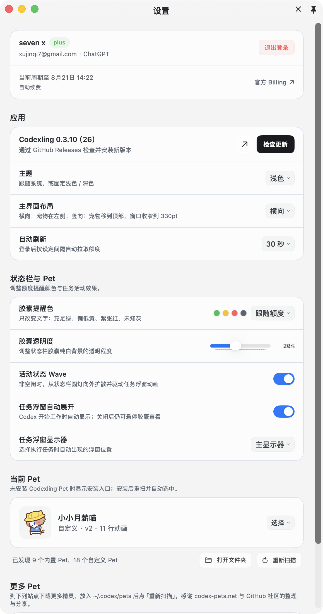

- 枚举：`DashboardOrientation`（`AppSettings.swift`），`case horizontal` / `case vertical`。
- 存储键：`codexling.dashboardOrientation`，默认 `horizontal`，纳入旧域（`com.qiizo.codex-light`）迁移名单。
- 变更回调：`AppSettingsStore.onDashboardOrientationChanged`。
- 切换即时生效，无需重启：`DetachedUsageWindowView` 监听该值并向窗口控制器重新上报 `DetachedWindowContentMode`。

## 3. 两种方向的成品

### 3.1 横向

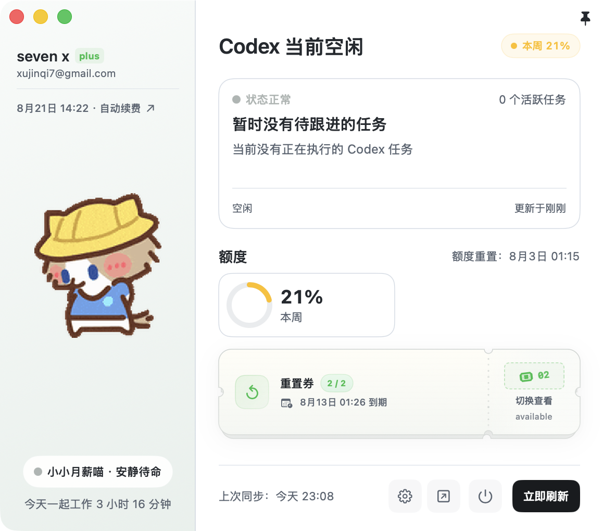

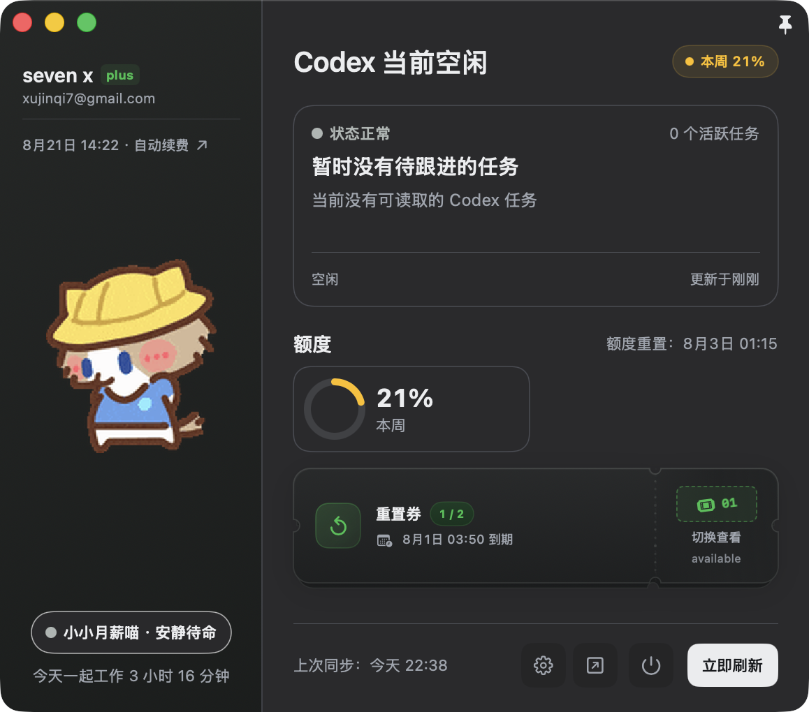

### 3.2 竖向

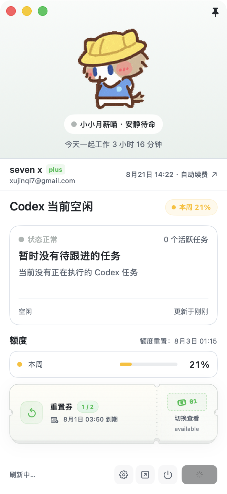

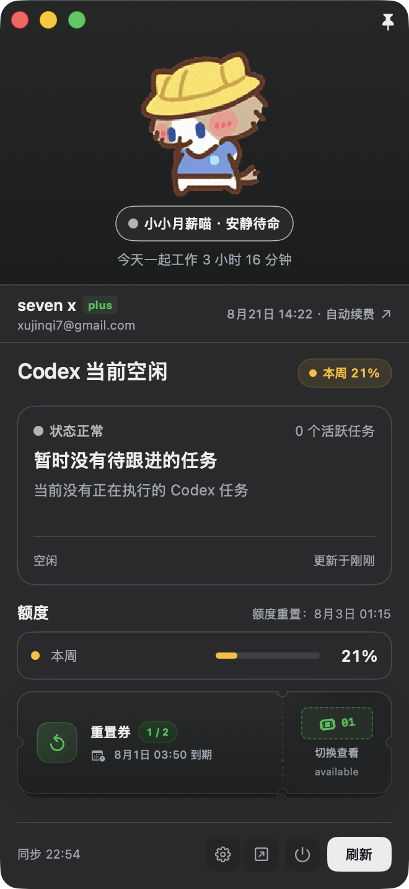

浅色那张恰好抓到了刷新中的状态：底部文案变成「刷新中…」，刷新按钮显示转圈并禁用，对应 `SyncFooterView` 的 `isRefreshing` 分支。

## 4. 结构映射

竖版不是重画一套界面，而是把横版的元素换个位置。下表列出每个元素的落点，以及为什么这么放。

| 横向（原有） | 竖向 | 说明 |
| --- | --- | --- |
| 左侧 188pt 侧栏，Pet 145 × 218 | 顶部形象区，Pet 132 × 132 | 横向空间全部让给内容；Pet 的点击涟漪与随机动作原样保留 |
| 侧栏底部陪伴胶囊 + 陪伴时长 | Pet 下方，顺序不变 | 文案同为 `"\(petName) · \(state.companionText)"` |
| 侧栏顶部账号块（两行 + 分隔线 + 账单链接） | 独立一条 46pt 账号行 | 姓名、plan badge、邮箱在左，账单摘要在右 |
| 标题 20pt + 右侧概览胶囊 | 标题 17pt，胶囊不变 | 330pt 下 20pt 标题会截断，另加 `minimumScaleFactor(0.85)` |
| 任务卡固定高 144pt | 同左 | 完全复用 `TaskStackView`，含牌堆与翻页 |
| 额度环卡 169pt × 2 并排 | **单行横条 × 2**，每行 38pt | 唯一的形态变化：330pt 塞不下两张 169pt 卡 |
| 重置券票根卡 82pt，最多 3 层堆叠 | 同左 | 完全复用 `ResetCouponSummaryView` |
| 底部同步条 46pt，图标 32pt | 40pt，图标 28pt | 按钮数量仍随 `showsDetachedButton` 变化 |
| 「上次同步：今天 23:04」 | **「同步 23:09」** | 第二处必要改动：减去按钮后只剩约 120pt，原文案会截断；完整内容保留在 tooltip |

只有加粗的两行是被迫改变形态的，其余都是原样搬运。

## 5. 共享的判断逻辑

以下分支两种方向走的是同一段代码，行为逐条一致：

| 分支 | 条件 | 表现 |
| --- | --- | --- |
| 活动状态 | `CodexActivityState` 八个 case | 陪伴胶囊圆点、任务卡状态点与标签、卡底活动标签、无任务时的兜底标题 |
| 会员到期提醒 | `showsSubscriptionExpiryReminder`（剩余 ≤ 7 天） | 标题行下方插入琥珀色 banner，四种文案由剩余天数与续费状态决定 |
| 多任务牌堆 | `tasks.count > 1` | 卡片右侧留 8pt 垫层，右下角提示「点击查看任务 N」 |
| 任务元数据 | `workspaceName` / `gitBranch` / `model` 各自可空 | 全空时整行不渲染，卡片高度不变 |
| 5 小时窗口 | `hasShortWindow` | 为 false 时整条隐藏，本周自动成为 `primaryWindow` |
| 额度全无 | `!hasShortWindow && !hasWeeklyWindow` | 显示「额度暂不可用」占位 |
| 额度重置时间 | `detailWindow?.resetsAt` | 为 nil 时标题行只剩「额度」两个字 |
| 健康度配色 | `QuotaHealthLevel.from(window:isLoggedIn:)` | ≥50% 绿 / 20–50% 黄 / <20% 红 / 未登录或 `total == 0` 灰 |
| 次要指标 | 两个窗口都存在时 | 本周使用 `codexBlue`，健康度色只给 `primaryWindow` |
| 重置券 | `tickets.count` | 0 张占位卡；1 张票根写「可用券」且不可点；≥2 张写「切换查看」，堆叠最多 3 层 |
| 账号降级 | `accountName` / `planName` / `subscriptionCompactSummaryLine` 各自可空 | 姓名回退到邮箱 @ 前缀；plan badge 隐藏；账单摘要回退成「订阅与账单」 |
| Pet 回落 | `currentFrame` → `selectedPet` 静态帧 → 无 Pet | 占位圆点用当前活动状态色填充 |
| 刷新状态 | `refreshState` | 刷新中转圈并禁用；错误时文案变红并附上次成功时间 |
| 未登录 | `store.isLoggedIn == false` | 整个 dashboard 被 `CompanionLoginView` 顶掉，与方向无关 |

> `UsageWindow.percent = remaining / total`，所以「本周 21%」是**剩余 21%**；横条填充长度同样代表剩余量。

## 6. Material Wave 保留验证

竖版复用了横版的全部手势与波纹实现，三处可交互区域都验证过。左列横向，右列竖向。

**宠物区**：点击播放涟漪并触发一次随机动作（`frameStore.playRandomIdleAction()`，受 `canPlayIdleInteraction` 约束）。

| 横向 | 竖向 |
| --- | --- |
| 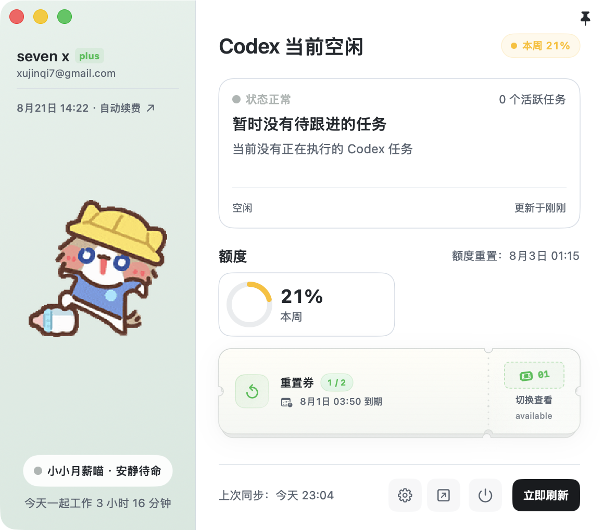 | 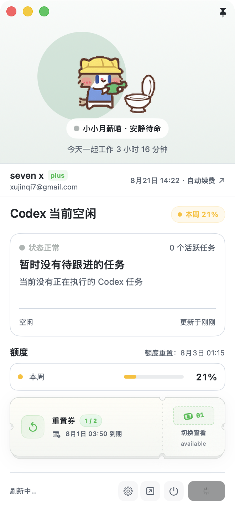 |

**任务卡**：点击播放涟漪并循环到下一个任务。

| 横向 | 竖向 |
| --- | --- |
| 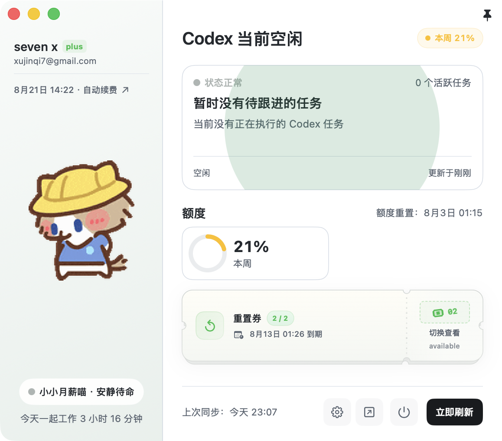 | 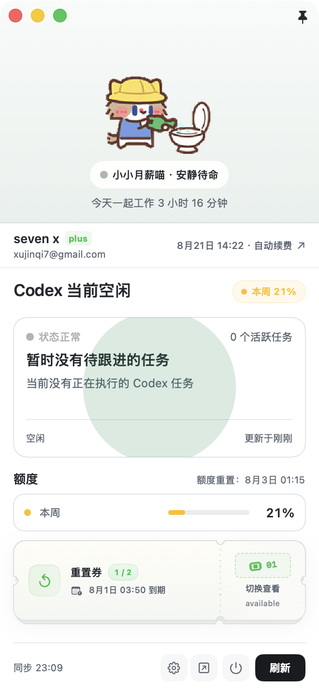 |

**重置券票根**：点击播放涟漪并翻到下一张，编号从 `01` 变 `02`，到期日随之更新。

| 横向 | 竖向 |
| --- | --- |
| 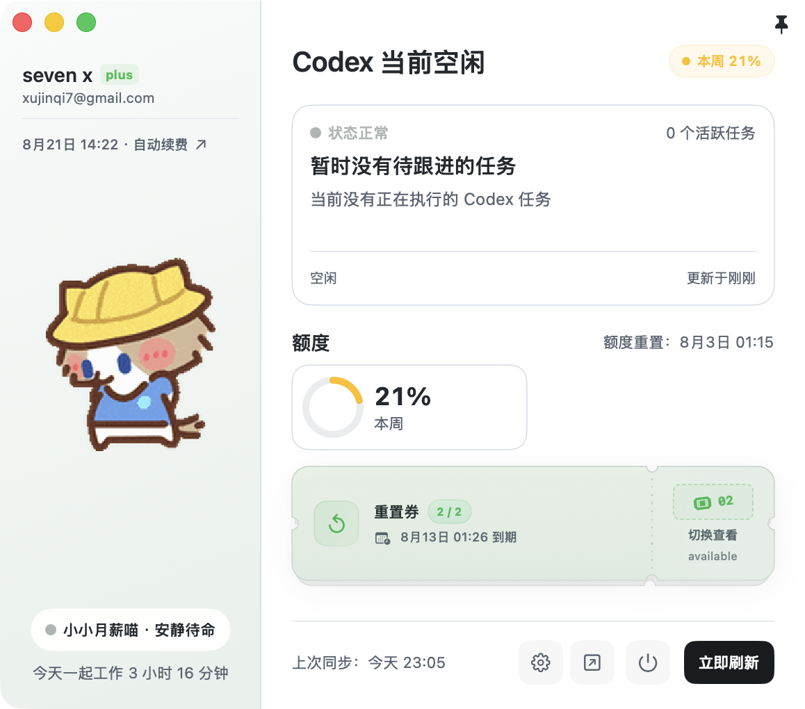 | 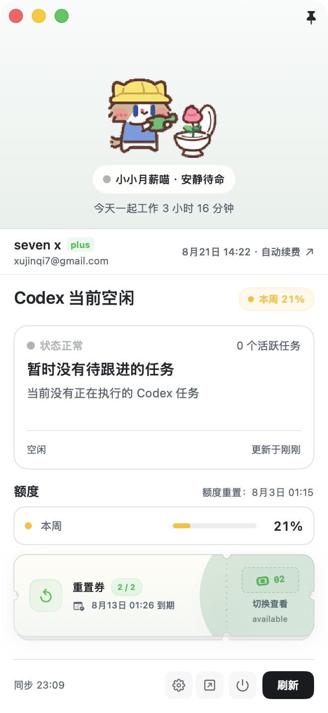 |

底部四个图标按钮和刷新按钮走的是 `DashboardIconButtonStyle` / `DashboardRefreshButtonStyle`，两者内部都是 `CodexMaterialWaveButtonBody`，两种方向共用，只有尺寸参数不同。

所有涟漪都遵守 `NSWorkspace.shared.accessibilityDisplayShouldReduceMotion`：开启「减弱动态效果」时不生成波纹，点击行为本身不受影响。

## 7. 实现要点

### 7.1 视图分发

`CompanionDashboardView.body` 在登录后按 `settings.dashboardOrientation` 分发到 `dashboard`（横向）或 `verticalDashboard`（竖向）。竖向新增三个组件，其余全部复用：

| 竖向新增 | 作用 |
| --- | --- |
| `CompanionPetHeader` | 顶部形象区，含渐变背景、涟漪手势、陪伴胶囊与陪伴时长 |
| `CompanionAccountRow` | 46pt 单行账号条 |
| `VerticalQuotaRowsView` / `VerticalQuotaRow` | 38pt 额度横条，轨道宽 84pt |

复用的组件：`ActivityHeading`、`SubscriptionExpiryReminderBanner`、`TaskStackView`、`ResetCouponSummaryView`、`SyncFooterView`、`InteractivePetStage`、`QuotaAtAGlanceChip`、`ChatGPTBillingCompactLink`。

### 7.2 紧凑参数

三个组件加了 `isCompact`，只影响字号与尺寸，不影响任何判断：

- `ActivityHeading`：标题 20pt → 17pt，并允许缩放到 0.85。
- `SyncFooterView`：文案缩写、字号 11 → 10、按钮间距收紧、条高 46 → 40。
- `DashboardIconButtonStyle` / `DashboardRefreshButtonStyle`：图标 32 → 28pt，刷新按钮最小宽 65 → 52pt。

### 7.3 窗口尺寸

`DetachedWindowContentMode.dashboard` 带上了 `orientation`，`DetachedWindowMetrics.fixedDashboardContentSize(isLoggedIn:orientation:measuredHeight:screen:)` 按方向返回尺寸：

- 横向：宽 `dashboardWidth`（579），高 `loggedInDashboardHeight`（510），与改动前完全一致。
- 竖向：宽 `verticalDashboardWidth`（330），高取内容实测值，钳制在 `verticalMinHeight`（360）与屏幕可视高度之间；未测出前先用 `verticalProvisionalHeight`（700）占位；未登录时复用 `loginDashboardHeight`（440）。

竖向的高度测量沿用设置页那套机制：`verticalDashboard` 用 `.fixedSize(horizontal: false, vertical: true)` 得到自然高度，经 `DashboardMeasuredContentHeightKey` 上报，`DetachedWindowController.commitVerticalDashboardHeight(_:)` 收敛窗口。因为测量值来自内容而非窗口，不会与 resize 形成回环。方向切换时 `applyContentLayout` 会作废上一次的测量值。

### 7.4 消除的重复

为避免两套布局各写一份规则而慢慢跑偏，以下逻辑做成了共享实现：

- `CodexUsageSnapshot.companionAccountName` / `companionPlanBadgeText`：账号名与 plan badge 的降级规则，`CompanionSidebar` 与 `CompanionAccountRow` 共用。
- `CompanionCopy.todayDuration(minutes:)`：陪伴时长文案，`CompanionSidebar` 与 `CompanionPetHeader` 共用。
- 任务选中态失效重置（被选中的任务消失后回退到第一个）提到了 `CompanionDashboardView.body`，两种方向共用一份。
- `SyncFooterView.syncHelpText`：tooltip 始终给出完整的同步时间与错误详情，不再随缩写文案变化。

## 8. 测试

`Tests/CodexlingTests/CodexlingTests.swift` 新增两条，共 62 条全部通过：

- `testDashboardOrientationDefaultsToHorizontalAndPersists`：默认横向、写入 `UserDefaults`、触发回调、重建 store 后恢复。
- `testVerticalDashboardKeepsNarrowWidthAndFollowsMeasuredHeight`：横向尺寸不变；竖向宽度固定 330；未测量时用占位高度；测量值向上取整；过矮时钳到下限；未登录时用登录页高度。
