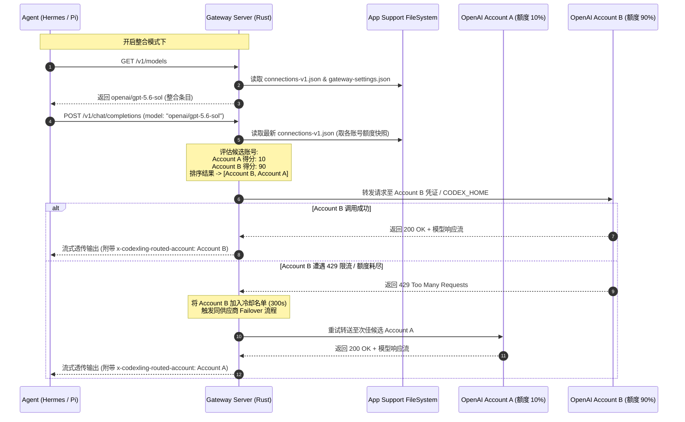

# Gateway 同供应商模型整合与额度调度方案

## 1. 背景与目标

### 1.1 现状与痛点

当前 Codexling Gateway 将连接注册表（`connections-v1.json`）中的每一个账号独立建模，在 `/v1/models` 中按“账号 × 模型”逐条导出，格式为 `provider/model@account-slug`（例如 `openai/gpt-5.6-sol@seven-x-openai-1a0c5fd1`）。

在多账号场景下，这种设计存在明显痛点：
1. **Agent 选型负担沉重**：Hermes、Pi 等 Agent 客户端的模型选择器中会列出同一模型的多个账号分身，用户必须手动挑选走哪一个账号。
2. **额度利用不均与单点耗尽**：当绑定的主账号 5 小时短窗口或周额度见底后，Agent 请求直接遭遇 429 报错，而用户持有的其他备用账号处于满额闲置状态。
3. **缺乏自动轮替与容灾能力**：网关目前为严格定向路由（UI 指标标明“跨账号/跨供应商回退：已禁用”），请求只认单一目标账号，无调度能力。

### 1.2 目标

在 Gateway 中增加一项**可选的扩展功能**：
- **同供应商模型整合**：同一个供应商旗下所有有效账号所支持的相同模型，在网关模型目录中聚合成唯一的逻辑模型对外暴露（例如 `openai/gpt-5.6-sol`）。
- **按额度自动调度出流**：Agent 请求该整合模型时，无需关心具体账号是谁，网关依据当前各账号的剩余额度健康状况，**按额度从高到低自动分配出流接口**。
- **默认关闭**：不破坏既有“逐账号隔离、严格定向”的既有心智与配置。
- **向后兼容**：开启后，旧有带 `@account` 后缀的请求依然支持精确定向；只有请求不带账号限定的整合模型时，才触发按额度自动调度。

---

## 2. 核心架构与设计原则

```text
┌────────────────────────────────────────────────────────┐
│                   Codexling macOS App                  │
│                                                        │
│  ┌──────────────────────┐    ┌──────────────────────┐  │
│  │     GatewayView      │    │     GatewayStore     │  │
│  │   (整合开关/状态预览) │    │  (整合模型计算/配置同步)│  │
│  └──────────┬───────────┘    └──────────┬───────────┘  │
│             │                           │              │
│             ▼                           ▼              │
│     gateway-settings.json       connections-v1.json     │
│       (独立配置/原子写入)        (账号注册表/额度快照)    │
└─────────────┬───────────────────────────┬──────────────┘
              │                           │
              │  (每请求读取，热生效)      │
              ▼                           ▼
┌────────────────────────────────────────────────────────┐
│               codexling-gateway (Rust)                 │
│                                                        │
│  ┌──────────────────────────────────────────────────┐  │
│  │ /v1/models: 依据开关输出整合列表或逐账号列表       │  │
│  └──────────────────────────────────────────────────┘  │
│  ┌──────────────────────────────────────────────────┐  │
│  │ 调度器 (Quota-based Scheduler)                    │  │
│  │  1. 解析目标模型 (无账号限定)                      │  │
│  │  2. 聚合该供应商下候选账号                        │  │
│  │  3. 归一化额度得分 (0~100)                         │  │
│  │  4. 排序: (得分 DESC, 最近选用时间 ASC)            │  │
│  │  5. 剔除冷却中账号，依次出流                       │  │
│  │  6. 429/耗尽熔断冷却，同供应商内故障转移 (Failover)│  │
│  └──────────────────────────────────────────────────┘  │
│                                                        │
│  ┌──────────────┐  ┌──────────────┐  ┌──────────────┐  │
│  │ OpenAI/Codex │  │    Gemini    │  │   DeepSeek   │  │
│  │   Upstream   │  │   Upstream   │  │   Upstream   │  │
│  └──────────────┘  └──────────────┘  └──────────────┘  │
└────────────────────────────────────────────────────────┘
```

### 核心设计原则

1. **同供应商严格内循环，绝不跨供应商**：
   OpenAI 账号池仅在 OpenAI 账号间调度，Gemini 仅在 Google 账号间调度；跨供应商同名模型（如 DeepSeek 官方的 `deepseek-chat` 与 OpenCode 聚合提供的同名模型）绝对不整合为同一个，坚决守住供应商隔离防线。
2. **零配置侵入**：
   不修改 `connections-v1.json` 的 Codable Schema（避免 Swift 序列化未知字段被吞的问题），采用独立的 `gateway-settings.json` 承载开关与策略。
3. **解析器天然兼容**：
   整合模型导出为 `provider/model` 标准格式（例如 `openai/gpt-5.6-sol`）。由于不含 `@`、`(` 等账号分隔符，现存解析器自然判定 `account_filter = None`，无缝流转至额度调度分支。

---

## 3. 配置载体与持久化

### 3.1 配置文件位置

使用独立的配置文件，放置于 App Support 目录：

```text
~/Library/Application Support/Codexling/gateway-settings.json
```

权限设置为 `0600`。Swift 侧为唯一写入方（采用原子写入写临时文件再 `rename`），Rust Gateway 每次处理请求时重读该文件，实现免重启秒级热生效。

### 3.2 配置 Schema

```json
{
  "$schemaVersion": 1,
  "modelConsolidationEnabled": false,
  "allowFailover": true,
  "cooldownSeconds": 300,
  "maxFailoverRetries": 2
}
```

| 字段 | 类型 | 默认值 | 作用 |
|---|---|---|---|
| `modelConsolidationEnabled` | `bool` | `false` | 总开关：开启后 `/v1/models` 输出整合目录，裸请求启用额度分配 |
| `allowFailover` | `bool` | `true` | 首选账号遭遇 429/额度耗尽/网络错误时，是否在同供应商内自动尝试下一个可用账号 |
| `cooldownSeconds` | `u64` | `300` | 遇到 429/额度耗尽后，该账号在内存中熔断冷却的基准秒数 |
| `maxFailoverRetries` | `usize` | `2` | 单次请求允许在同供应商内失败重试的最大账号数 |

---

## 4. 模型整合与导出规则

### 4.1 归一化聚合逻辑

1. 遍历注册表中的所有有效连接（`isEnabled == true && authenticationState == connected`）。
2. 对账号拥有的 `availableModelIDs` 进行模型名标准化：
   - 剥离前缀：如 `models/`
   - 剥离路由后缀：如 `-tiered`、`-wm`
3. 聚合键：`Key = (provider, normalized_model_id)`。
4. 统计每个聚合键对应的账号数、综合额度指标。

### 4.2 `/v1/models` 导出格式对比

| 状态 | 导出的 Model ID 示例 | 导出的 Name / 备注 |
|---|---|---|
| **默认（关闭）** | `openai/gpt-5.6-sol@seven-x-openai-1a0c5fd1`<br>`openai/gpt-5.6-sol@personal-codex-2b1d` | 分别显示各个账号的名牌与独立额度 |
| **开启整合** | `openai/gpt-5.6-sol`<br>`google/gemini-3.6-flash`<br>`deepseek/deepseek-chat`<br>`opencode/kimi-k3` | `OpenAI · gpt-5.6-sol (整合 2 账号 · 最高额度 85%)` |

> 客户端若使用不带前缀的裸模型名（如 `gpt-5.6-sol`）发起调用，网关借助现有的候选发现机制，在开启整合时同样会进入额度调度。

---

## 5. 额度评分与调度算法

### 5.1 各供应商额度健康分归一化（0 ~ 100 分）

为了能够跨账号进行统一排序，网关为每个候选账号计算一个 `0 ~ 100` 的整数健康得分（Score）：

```text
Score 计算规则：

1. OpenAI / Codex 账号:
   - 若存在 usage.shortWindow (5h 窗口):
     Score = (shortWindow.remaining / shortWindow.total) * 100
   - 否则若存在 usage.primary / secondary (周窗口):
     Score = (window.remaining / window.total) * 100
   - 若无窗口快照或为 Pro/Team 账号且无用量: 默认 100
   - 若短窗口剩余为 0: Score = 0 (已耗尽)

2. Google Gemini 账号:
   - remaining = min(geminiFiveHourRemaining ?? 1.0, geminiWeeklyRemaining ?? 1.0)
   - Score = clamp(remaining * 100, 0, 100)
   - 若 cooldownResetsAt 处于未来时间: Score = 0 (冷却中)

3. DeepSeek 账号 (以余额计):
   - balance.total <= 0: Score = 0 (欠费/无额度，直接剔除)
   - balance.total <= 10.0: Score = 30 (低余额警戒)
   - balance.total <= 50.0: Score = 70
   - balance.total > 50.0: Score = 100

4. OpenCode 账号 (第三方聚合，无额度 API):
   - 账号正常连接: Score = 100 (全量参与，依据使用频次轮转)
```

### 5.2 账号选择流程

当收到请求且 `account_filter.is_none()` 且 `modelConsolidationEnabled == true` 时：

1. **候选池初筛**：
   - 属于当前匹配的 `provider`；
   - `isEnabled == true` 且 `authenticationState == connected`；
   - 模型清单中包含目标模型；
   - 必须具备有效凭证（Codex 必须有 `oauth_token.json`，API 账号必须有非空 Key）。
2. **冷却过滤**：
   - 检查内存中的 `AccountCooldownRegistry`，若当前时间 `< cooldown_until`，将其移出第一梯队（或仅作为降级兜底）。
3. **多维排序**：
   对候选账号执行稳定排序：
   ```rust
   candidates.sort_by(|a, b| {
       // 第一关键字：额度健康得分 (降序，高分优先)
       b.score.cmp(&a.score)
           // 第二关键字：最近选用时间戳 (升序，LRU 轮换，避免高分账号被单点击穿)
           .then_with(|| a.last_served_at.cmp(&b.last_served_at))
           // 第三关键字：账号 ID (保底确定性)
           .then_with(|| a.connection_id.cmp(&b.connection_id))
   });
   ```
4. **选取与状态更新**：
   - 取排序第一位的账号作为出流目标；
   - 更新内存中该账号的 `last_served_at = now()`；
   - 在 Telemetry 记录中打上实际命中的 `routed_account_id` 与 `routing_mode = "pooled"`。

### 5.3 故障熔断与同供应商 Failover

在实际生产中，账号虽然表面上有额度，但在并发调用下可能突然触发 429、短时间 Token 耗尽或 401 凭证失效。

```text
发起请求 -> [账号 A]
           │
           ├─ 成功 -> 正常返回
           │
           └─ 失败 (HTTP 429 / 额度耗尽 / 401)
                │
                ├─ 记录 [账号 A] 熔断: cooldown_until = now() + 300s
                ├─ 检查: 重试次数 < maxFailoverRetries && allowFailover == true
                │
                ├─ 重新挑选下一个最佳候选 [账号 B]
                └─ 重试出流...
```

- **重试安全边界**：仅限网络握手阶段、429 限流或返回流开始之前的状态码错误才触发重试。如果已经向上游输出了第一块流式 chunk（TTFT 发生后），不可切换账号，直接透传错误以防产生断流幻觉。
- **故障隔离**：重试绝不跨越到其他供应商，即使全 OpenAI 账号失败，也不会自动尝试 Gemini。

---

## 6. 各端工程改造清单

### 6.1 Rust 网关端 (`crates/gateway-server/src/server.rs`)

1. **配置读取模块**：
   - 实现 `GatewaySettings::load(app_support_dir)`，若文件不存在则返回默认关闭配置。
2. **内存状态容器**：
   - 在网关全局状态中加入 `Arc<Mutex<AccountDynamicState>>`：
     - `cooldown_map: HashMap<String, Instant>`
     - `last_served_map: HashMap<String, Instant>`
3. **`/v1/models` 聚合改造 (`get_dynamic_models_payload_for_home`)**：
   - 读取配置；若开启整合，使用 `BTreeMap<(Provider, String), ConsolidatedModelEntry>` 进行归一化分组；
   - 仅输出一条合并后的条目，附带账号数量与额度标签；
   - 若关闭，则保留现有逐账号输出逻辑不变。
4. **路由决议核心改造 (`resolve_upstream_endpoint_for_home`)**：
   - 在四大供应商分支中，当 `account_filter.is_none()` 时，引入 `select_best_account_by_quota(...)`；
   - 显式带账号后缀的请求，完全保持既有的定点路由逻辑；
   - 在出流包装层（`proxy_chat_completions` 等）中集成同供应商错误捕捉与 Failover 循环。
5. **遥测数据注入**：
   - 在响应头或 Telemetry Record 中注入 `x-codexling-routed-account` 和 `x-codexling-quota-score`。

### 6.2 Swift App 端

1. **设置模型与文件同步**：
   - 新增 `GatewaySettingsStorage` 类，负责写入/读取 `gateway-settings.json`；
   - 在 `GatewayStore` 中增加 `@Published var isModelConsolidationEnabled: Bool`，修改时同步落地文件并镜像到 `UserDefaults`。
2. **模型清单聚合展示 (`GatewayStore.swift`)**：
   - 新增 `consolidatedModelGroups: [GatewayModelGroup]` 计算属性；
   - 当 `isModelConsolidationEnabled == true` 时，`allExportedModels`、`hermesPickerModels` 等对外暴露属性切换为整合后的模型集合。
3. **UI 交互更新 (`GatewayView.swift`)**：
   - 在「接入与模型」Tab 顶部增加「模型整合与额度调度」开关卡片：
     - 开关控件：控制总开关；
     - 整合效果概览：以卡片形式呈现例如“已将 5 个 OpenAI 账号整合成 8 个高可用模型”、“按额度自动负载均衡”；
     - 状态指标联动：将原先“跨账号/跨供应商回退：已禁用”更新为“同供应商额度自动调度（已开启）/ 严格隔离（未开启）”。
4. **Agent 配置器联动**：
   - `HermesGatewayConfigurator` 与 `PiGatewayConfigurator` 依据新的整合清单生成模型白名单与配置指纹；
   - 切换开关后触发重新同步，自动将 Agent 端使用的模型更新为纯净的无账号后缀格式。

---

## 7. 端到端调用时序图



---

## 8. 边界条件与异常处理

| 场景 | 应对策略 |
|---|---|
| 某供应商只有一个可用账号 | 自动进入退化模式：聚合条目照常输出，调度算法直接命中该唯一账号，不影响流程。 |
| 所有账号均已耗尽或处于冷却中 | 剔除冷却惩罚，挑选理论额度相对最高的账号强制尝试一次；若上游报错，如实将错误回传给 Agent。 |
| Agent 请求依然带 `@account-slug` | 判定为定向请求，不进入额度调度，原样走指定账号；若该指定账号故障，不触发 Failover。 |
| Codex OAuth 账号 CLI 执行中出错 | `codex exec` 进程异常退出时，若尚未向客户端返回有效 payload，捕获退出码并转入备用账号进程。 |
| 跨供应商同名模型 | 导出时强制附带供应商域前缀（如 `openai/` vs `opencode/`），绝对不合并到同一条目中。 |

---

## 9. 测试与验证计划

### 9.1 Rust 自动化单元测试 (`gateway-server`)
- [ ] **设置文件反序列化测试**：测试缺省不存在、格式损坏、正常开启等不同情况下的加载状态。
- [ ] **模型聚合测试**：构造包含 3 个 OpenAI 账号（分别拥有不同模型交集）的 mock 注册表，验证整合后的 payload 是否正确去重，且条目数量与预想完全一致。
- [ ] **额度排序算法测试**：验证 90% 额度账号排在 20% 额度账号之前；验证额度相同情况下，最近未使用的账号优先排前（LRU 轮替）。
- [ ] **冷却与熔断测试**：模拟账号遭遇 429 注入冷却，验证下一次调用是否直接跳过该账号选取备用账号。
- [ ] **显式账号绕过测试**：验证输入带 `@slug` 的模型名时，绝不触发调度器重排序。

### 9.2 Swift 端测试 (`GatewayTests.swift`)
- [ ] **配置存储回环测试**：验证 `GatewaySettingsStorage` 写入和读取的一致性。
- [ ] **整合列表视图模型生成**：测试在内存注入多个虚拟连接，验证 `GatewayStore` 计算出的整合模型列表结构。
- [ ] **Agent 指纹变化测试**：验证切换开关时，是否正确触发模型白名单变更与重新导出。

### 9.3 端到端集成验收
- [ ] 在 Codexling 中配置 2 个 Codex 账号与 2 个 Gemini 账号。
- [ ] 开启整合开关，在 Hermes 与 Pi 中检查模型选择器是否变为简洁的 `openai/gpt-5.6-sol` 等。
- [ ] 运行一次耗时任务，观察 Gateway 监控概览与日志，确认请求按预期流向高额度账号。

---

## 10. 分期实施路线

```text
Phase 1: 核心调度与模型目录 (核心功能可用)
  ├─ 1.1 Swift 建立 gateway-settings.json 配置类与基础绑定
  ├─ 1.2 Rust 实现设置读取与各供应商额度分数归一化 (Score 计算)
  ├─ 1.3 Rust 实现 get_dynamic_models_payload 整合输出 (开关控制)
  └─ 1.4 Rust 实现 resolve_upstream_endpoint 额度排序选取

Phase 2: 熔断与同供应商故障转移 (生产级高可用)
  ├─ 2.1 Rust 维护内存冷却与 LRU 轮替表
  ├─ 2.2 出流层捕获 429/401 并实现同供应商内自动 Failover 重试
  └─ 2.3 Telemetry 与 /status 接入调度详情指标

Phase 3: UI 交互与 Agent 自动化闭环
  ├─ 3.1 GatewayView 增加整合配置卡与额度预览卡
  ├─ 3.2 GatewayStore 联动更新 Hermes/Pi 配置文件
  └─ 3.3 文档更新与自动化集成回归
```
