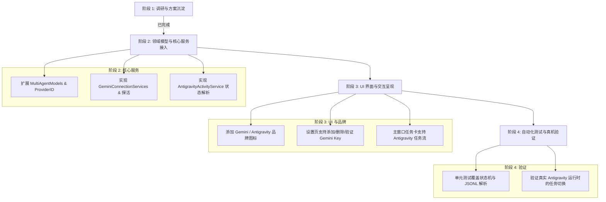

# Gemini 供应商额度查询与 Antigravity 桌面端状态检测可行性调研及方案

> 日期：2026-08-24  
> 状态：调研完成，方案就绪，已完成本机协议与文件系统可行性验证  
> 适用项目：Codexling (macOS Native Multi-Agent Companion)

---

## 1. 调研背景与目标

Codexling 正在从单一的 OpenAI Codex 伴侣演进为支持多 Agent 与多 Provider 的统一桌面中枢。本期调研聚焦两个核心诉求：

1. **Gemini 供应商接入与额度/用量查询**：分析 Google Gemini 官方 API、Google AI Studio、Google Cloud 配额（Cloud Quotas）体系，确定在 Codexling 中如何安全、可靠地管理 Gemini API Key 并展示额度/模型健康度。
2. **Antigravity 桌面端/IDE/CLI 状态检测**：调研 Google Antigravity 本地运行时（Electron 桌面端、IDE、CLI）的任务存储与事件流，实现只读的实时任务状态监听（思考中、执行中、代码审查、等待确认、已完成等），驱动菜单栏圆灯、刘海面板与 Pet 动画。

---

## 2. Gemini 供应商额度与用量查询调研

### 2.1 Google Gemini 账号与服务类型矩阵

与 DeepSeek（提供单个 Key 对应现金余额接口）不同，Google Gemini 生态分为四种截然不同的账务与访问形态：

| 接入形态 | 认证方式 | 计费与配额模型 | 可程序化读取的额度/用量信号 | Codexling 适配策略 |
|---|---|---|---|---|
| **A. Google AI Studio (API Key)**<br>`generativelanguage.googleapis.com` | API Key (`AIza...`) | • **Free Tier**：按 RPM / TPM / RPD 限流，免费。<br>• **Pay-as-you-go**：关联 Google Cloud 账单，按 Token 计费。 | • **探活与模型列表**：`GET /v1beta/models?key=...`<br>• **速率头**：响应中包含 `x-ratelimit-remaining` / `Retry-After`<br>• **单次请求用量**：`usageMetadata` 携带 Token 数<br>• **现金余额**：**无**（Google 不提供基于纯 API Key 的余额查询接口） | **首选方案（BYOK 模式）**：<br>1. 安全存储 Key<br>2. 探活验证与可用模型发现<br>3. 监控 Rate Limit 状态与 429 冷却<br>4. 记录本地会话 Token 消耗估算 |
| **B. Google Cloud Vertex AI / Cloud Quotas**<br>`aiplatform.googleapis.com` | Google Cloud IAM / OAuth 2.0 / ADC / Service Account | 企业级 GCP 账单，按月结算，配额由 Cloud Quotas 管理。 | • **Cloud Quotas API** (`cloudquotas.googleapis.com`) 可查项目级 RPM/TPM 限额。<br>• **Cloud Billing API** 可查项目账单与预算。<br>• **Cloud Monitoring API** 可查实际调用次数与配额利用率。 | **进阶方案（GCP 模式）**：<br>当用户提供 GCP Project ID 并授权 gcloud/ADC 时，调用 Cloud Quotas API 读取项目级真实限额。 |
| **C. Gemini CLI / Antigravity 官方登录** | Google OAuth 2.0 (个人/Workspace 账号) | 包含在个人或 Workspace 订阅中，由 Google 统一调度。 | • 客户端内提供 `/stats` 查看会话消耗。<br>• 官方协议不公开外部独立用量 API。<br>• **官方条款明确限制第三方应用收割/复用其 OAuth Token**。 | **合规边界**：Codexling **绝不**提取或劫持官方 CLI/IDE 的内部 OAuth Token，保持边界独立。 |
| **D. Gemini Consumer (Web)**<br>`gemini.google.com` (Advanced / One AI) | Google Account Web Cookie / Session | 订阅制（Google One AI Premium）。 | • 无任何公开 API。<br>• 仅限网页端交互。 | **不支持**（避免脆弱且违反 TOS 的 Cookie 逆向）。 |

---

### 2.2 官方 API 接口详解与可行性分析

#### 1. API Key 探活与可用模型列表（零消耗探活）
- **接口**：`GET https://generativelanguage.googleapis.com/v1beta/models?key={API_KEY}`
- **鉴权**：Query Parameter `key={API_KEY}` 或 Header `x-goog-api-key: {API_KEY}`
- **耗费**：不消耗生成 Token，无计费。
- **返回数据**：
  ```json
  {
    "models": [
      {
        "name": "models/gemini-2.5-pro",
        "version": "001",
        "displayName": "Gemini 2.5 Pro",
        "description": "...",
        "inputTokenLimit": 2097152,
        "outputTokenLimit": 8192,
        "supportedGenerationMethods": ["generateContent", "countTokens"]
      },
      {
        "name": "models/gemini-2.5-flash",
        "displayName": "Gemini 2.5 Flash",
        "inputTokenLimit": 1048576,
        "outputTokenLimit": 8192
      }
    ]
  }
  ```
- **价值**：
  - 毫秒级验证 API Key 是否有效。
  - 自动识别当前 Key 能够访问的最新模型列表（如 Gemini 2.5 Pro, Gemini 2.5 Flash 等）。
  - 提取模型的 `inputTokenLimit` 作为上下文窗口参考。

#### 2. 速率限制与 429 冷却监控
- Gemini API 在 HTTP 响应头中提供速率限制指标：
  - `x-ratelimit-remaining`: 当前窗口剩余可用请求数。
  - 触发限流时（HTTP 429 `RESOURCE_EXHAUSTED`）：返回 `Retry-After: {seconds}` 响应头。
- **价值**：Codexling 可以精准捕获 API 的健康状态，并在 UI 上展示“429 冷却倒计时”，避免盲目重试。

#### 3. Cloud Quotas API (针对高级/企业开发者)
- **接口**：`GET https://cloudquotas.googleapis.com/v1/projects/{PROJECT_ID}/locations/global/services/generativelanguage.googleapis.com/quotaInfos`
- **鉴权**：OAuth 2.0 Bearer Token（通过 `gcloud auth print-access-token` 或 Application Default Credentials）。
- **返回数据**：包含 `GenerateContentRequestsPerMinutePerProjectPerRegion` 等配额维度的具体数值、调整历史与当前限额。

---

### 2.3 Codexling Gemini Provider 落地设计

在 Codexling 领域模型中，将 Gemini 建模为标准的 API Provider（与 `DeepSeekAPIConnection`、`OpenCodeAPIConnection` 并列）：

```text
┌───────────────────────────────────────────────────────────┐
│ GeminiAPIConnection                                       │
├───────────────────────────────────────────────────────────┤
│ • id: ConnectionID                                        │
│ • label: String ("Gemini Personal" / "Work Project")      │
│ • credentialHandle: String                                │
│ • keyMask: String ("...k9Ab")                             │
│ • supportedModels: [String] (["gemini-2.5-pro", ...])     │
│ • status: ProviderStatus (.valid / .rateLimited / .error) │
│ • lastValidatedAt: Date                                   │
│ • lastError: String?                                      │
│ • optionalGCPProjectID: String?                           │
└───────────────────────────────────────────────────────────┘
```

- **凭证存储**：保存在 `~/Library/Application Support/Codexling/gemini_credentials/<handle>.json`，文件权限锁定为 `0600`。
- **卡片展示**：
  - 展示 Gemini 品牌 Logo 与连接标签。
  - 状态胶囊：绿色（正常）、黄色（429 冷却中）、红色（Key 失效）。
  - 展示当前可调用的最新模型列表与支持的上下文长度。
  - 提供“立即验证”、“查看 AI Studio 控制台”等快捷动作。

---

## 3. Antigravity 桌面端状态检测调研与可行性验证

### 3.1 本机架构与文件系统实测

经过对 macOS 本地环境的实际探索，证实 Google Antigravity 在本地拥有清晰、规范的文件存储和日志结构：

```text
/Applications/Antigravity.app
└── Contents/Resources/bin/language_server    # 核心 Language Server 引擎

~/.gemini/
├── antigravity/
│   ├── bin/agentapi                          # CLI 桥接入口
│   ├── antigravity_state.pbtxt               # 全局状态配置
│   ├── conversations/                        # 会话数据库目录
│   │   ├── <conversation-id>.db              # 单个会话的 SQLite 数据库
│   │   ├── <conversation-id>.db-wal          # WAL 实时写入日志
│   │   └── <conversation-id>.db-shm
│   └── brain/                                # 会话 Workspace 与执行日志
│       └── <conversation-id>/
│           ├── .system_generated/logs/
│           │   ├── transcript.jsonl          # 实时追加的结构化步骤日志 (精简版)
│           │   └── transcript_full.jsonl     # 完整步骤日志
│           └── scratch/                      # 临时脚本与产物
├── antigravity-ide/                          # IDE 模式独立数据
└── config/
    └── config.json                           # 用户界面与全局设置
```

---

### 3.2 结构化事件流（`transcript.jsonl`）验证

Antigravity 的 `transcript.jsonl` 是以逐行追加（Append-Only）方式记录的 JSON Lines 格式。每一行对应 Agent 执行的一个原子步骤（Step）：

#### 步骤数据结构实测：
```json
{
  "step_index": 4,
  "source": "MODEL",
  "type": "PLANNER_RESPONSE",
  "status": "DONE",
  "created_at": "2026-08-24T07:42:14Z",
  "tool_calls": [
    {
      "name": "view_file",
      "args": {
        "AbsolutePath": "/Users/.../PROJECT.md",
        "toolAction": "Viewing PROJECT.md",
        "toolSummary": "View PROJECT.md"
      }
    }
  ]
}
```

#### 常见步骤类型与来源：
- `source`:
  - `"USER_EXPLICIT"`：用户输入。
  - `"MODEL"`：模型决策或工具调用。
  - `"SYSTEM"`：系统提示词或 Checkpoint。
- `type`:
  - `"USER_INPUT"`：用户发送的任务或指令。
  - `"PLANNER_RESPONSE"`：模型决策（包含 `tool_calls` 或最终文本回复）。
  - `"GENERIC"`：工具执行返回的结果。
  - `"CHECKPOINT"`：上下文摘要与截断。

---

### 3.3 任务状态机映射方案

基于 `transcript.jsonl` 的最后若干行记录，Codexling 可以无缝映射出 `CodexActivityState`：

| Antigravity 事件特征 | Codexling 状态 (`CodexActivityState`) | 菜单栏圆灯 | 状态标签与描述 |
|---|---|---|---|
| 最后一条记录为 `USER_INPUT`，或模型正在等待下一轮推演 | `.thinking` | 紫色 | **思考中** (`"正在分析任务与规划方案..."`) |
| 最后一条记录包含修改类工具（`run_command`, `write_to_file`, `replace_file_content`）且正在执行 | `.executing` | 蓝色 | **执行中** (`"正在执行: \(toolAction)"`) |
| 最后一条记录包含只读类工具（`view_file`, `list_dir`, `grep_search`, `find_by_name`, `read_url_content`, `search_web`） | `.reviewing` | 青色 | **检查中** (`"正在浏览/检索: \(toolAction)"`) |
| 包含 `ask_question` 工具、等待 Plan 确认或等待权限审批 | `.waitingForUser` | 橙色 | **等待确认** (`"等待用户确认操作"`) |
| 模型生成最终纯文本答复，无挂起工具调用，且在活跃窗口内 | `.completed` | 绿色 | **已完成** (`"任务已完成"`) |
| 超过活跃窗口（默认 180s）无新事件，或处于等待用户新指令 | `.idle` | 灰色 | **空闲** (`"Antigravity 当前空闲"`) |
| 任务执行异常或进程终止 | `.interrupted` | 红色 | **已中止** (`"任务已中断"`) |

---

### 3.4 会话发现与多任务（Parallel Tasks）聚合算法

1. **扫描会话**：
   - 遍历 `~/.gemini/antigravity/conversations/` 下所有 `.db` 文件。
   - 读取文件的 `contentModificationDate`。
   - 筛选出在活跃窗口内（如最近 3 分钟内有修改）的会话列表。
2. **提取元数据**：
   - 定位对应会话的 `~/.gemini/antigravity/brain/<id>/.system_generated/logs/transcript.jsonl`。
   - 读取尾部最新事件推断当前状态。
   - 读取首个 `USER_INPUT` 内容解析任务标题（提取 `<USER_REQUEST>` 或 `# USER Objective:`）。
3. **优先级聚合**：
   - 将多个活跃会话打包为 `[CodexTaskActivity]` 数组。
   - 按照优先级规则（等待确认 > 执行中 > 检查中 > 思考中）选出主展示任务，完美支持主窗口任务卡片轮播与菜单栏计数。

---

## 4. Codexling 领域模型与架构扩展方案

```text
Codexling 整体架构
├── MultiAgentModels.swift
│   ├── AgentID.antigravity ("agent.antigravity")
│   ├── AgentSurfaceID.antigravityDesktop ("surface.antigravity-desktop")
│   ├── AgentSurfaceID.antigravityIDE ("surface.antigravity-ide")
│   ├── AgentSurfaceID.antigravityCLI ("surface.antigravity-cli")
│   ├── ProviderID.gemini ("provider.gemini")
│   └── GeminiAPIConnection
│
├── AntigravityActivityService.swift (新建)
│   ├── 会话发现 (conversations/*.db 活跃扫描)
│   ├── transcript.jsonl 尾部解析与状态机映射
│   └── 生成 CodexActivitySnapshot
│
├── GeminiConnectionServices.swift (新建)
│   ├── GeminiCredentialStore (0600 权限独立存储)
│   └── GeminiValidationService (GET /v1beta/models 探活与模型发现)
│
├── MultiAgentSettingsStore.swift
│   ├── 管理 geminiConnections
│   └── 注册 Antigravity 状态轮询
│
└── UI 展示层
    ├── AccountConnectionsSettingsView (Gemini API Key 添加/管理)
    ├── BrandAssets.swift (新增 Gemini / Antigravity 品牌图标与徽标)
    └── CompanionDashboardViews (展示 Antigravity 任务卡与 Gemini 连接卡)
```

---

## 5. 安全、合规与隐私原则

1. **只读本地监控**：
   - 对 `~/.gemini/antigravity` 下的数据库和 `transcript.jsonl` 只做**只读解析**（Read-Only）。
   - 不修改 Antigravity 的任何内部数据库、日志或运行时进程。
2. **敏感信息零持久化**：
   - 仅提取任务状态、工具名称与截断后的简短摘要（如 `toolAction`）。
   - **绝不持久化、不上传、不在 UI 展示**完整的 Prompt、模型 Reasoning 思维链、文件代码内容、命令行完整参数或环境变量。
3. **凭据安全隔离**：
   - Gemini API Key 保存于独立隔离目录（`~/Library/Application Support/Codexling/gemini_credentials/`），文件模式 `0600`。
   - 不与 DeepSeek / OpenCode / Codex 凭证混用，杜绝凭据越权。
4. **OAuth 合规**：
   - 严格遵循 Google 条款，不搭便车抓取官方 CLI/IDE 的内部 Google 登录 Token，API Key 与客户端状态完全解耦。

---

## 6. 分阶段实施路线图



- **第一阶段（当前）**：完成官方 API 调研、本地文件系统与 JSONL 协议可行性验证，产出本设计文档。
- **第二阶段（模型与底层服务）**：
  1. 在 `MultiAgentModels.swift` 中增加 `AgentID.antigravity`、`ProviderID.gemini` 与 `GeminiAPIConnection`。
  2. 新增 `GeminiConnectionServices.swift`，实现 Key 存储与 `/v1beta/models` 验证服务。
  3. 新增 `AntigravityActivityService.swift`，实现本地 `transcript.jsonl` 解析器与状态转换器。
- **第三阶段（UI 与设置集成）**：
  1. 在 `BrandAssets.swift` 中配置 Gemini 与 Antigravity 的图标与品牌色彩。
  2. 在设置页 `AccountConnectionsSettingsView` 中增加 Gemini API Key 连接卡片与管理面板。
  3. 在主窗口 Companion 面板与菜单栏圆灯上联动 Antigravity 任务状态。
- **第四阶段（测试与验证）**：
  1. 编写单元测试（`AntigravityActivityServiceTests`、`GeminiValidationServiceTests`）。
  2. 在真实 macOS 环境下进行 Antigravity 任务联动实测。
